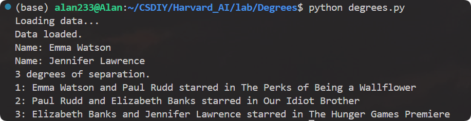

## Harvard CS 50 AI: Introduction to Artificial Intelligence with Python

- Course Website: https://cs50.harvard.edu/ai/
- Course Video: https://www.bilibili.com/video/BV1pk4y137dN
- Course Content:
    - Lec 0. Search: Depth-First Search, Breadth-First Search, Greedy Best-First Search, A* Search, Minimax, Alpha-Beta Pruning.
    - Lec 1. Knowledge: Propositional Logic. Entailment. Inference. Model Checking. Resolution. First Order Logic.
    - Lec 2. Uncertainty: Probability. Conditional Probability. Random Variables. Independence. Bayes’ Rule. Joint Probability. Bayesian Networks. Sampling. Markov Models. Hidden Markov Models.

- Course Lab:
    - Lab 1. Degrees: 给定数据集下, 计算两点间最短路.
  
       
  
      - 使用 bfs 同时记录前驱.
    - Lab 2. Tic-Tac-Toe: 实现一个人机交互, 玩井字棋.
  
       
      
      - 根据当前的 state 选择最优的 action. 我使用了 alpha-beta 剪枝优化 minimax 搜索, 实测效率有明显提升.
