## Harvard CS 50 AI: Introduction to Artificial Intelligence with Python

- Course Website: https://cs50.harvard.edu/ai/
- Course Video: https://www.bilibili.com/video/BV1pk4y137dN
- Course Content:
  - Lec 0. **Search**: Depth-First Search, Breadth-First Search, Greedy Best-First Search, A* Search, Minimax, Alpha-Beta Pruning.
  - Lec 1. **Knowledge**: Propositional Logic. Entailment. Inference. Model Checking. Resolution. First Order Logic.
  - Lec 2. **Uncertainty**: Probability. Conditional Probability. Random Variables. Independence. Bayes’ Rule. Joint Probability. Bayesian Networks. Sampling. Markov Models. Hidden Markov Models.
  - Lec 3. **Optimization**: Local Search. Hill Climbing. Simulated Annealing. Linear Programming. Constraint Satisfaction. Backtracking Search.
  - Lec 4. **Learning**: Supervised Learning. Nearest-Neighbor Classification. Perceptron Learning. Support Vector Machines. Regression. Loss Functions. Overfitting. Regularization. Reinforcement Learning. Markov Decision Processes. Q-Learning. Unsupervised Learning. k-means Clustering.
  - Lec 5. **Neural Networks**: Artificial Neural Networks. Activation Functions. Gradient Descent. Backpropagation. Overfitting. TensorFlow. Image Convolution. Convolutional Neural Networks. Recurrent Neural Networks.
  - Lec 6. **Language**: Syntax. Semantics. Context-Free Grammar. nltk. n-grams. Bag-of-Words Model. Naive Bayes. Word Representation. word2vec. Attention. Transformers.

- 有 quiz 和 project (我称之为 lab). quiz 我都完成了, lab 如下, 还挺有意思的!

- Course Lab:
  - Lab 1. Degrees: 给定数据集下, 计算两点间最短路.

    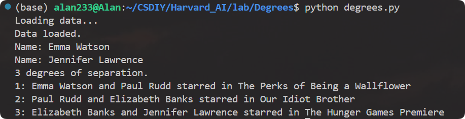 

    - 使用 bfs 同时记录前驱.
  - Lab 2. Tic-Tac-Toe: 实现一个人机交互, 玩井字棋.

    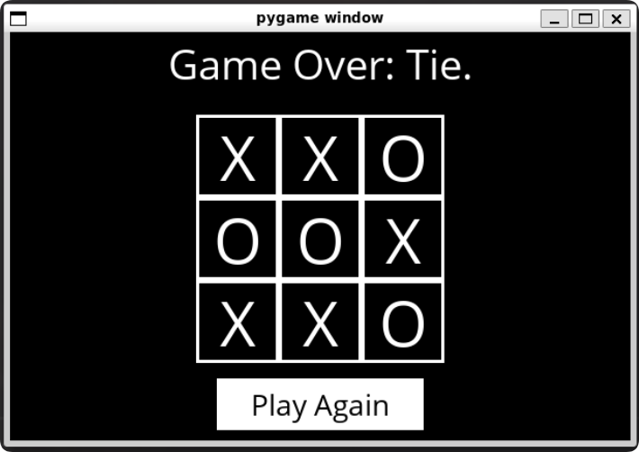 
    
    - 根据当前的 state 选择最优的 action. 我使用了 alpha-beta pruning 优化 minimax 搜索, 实测效率有明显提升.

  - Lab 3. knights: 构建知识库, 使用自动逻辑求解器, 判断每个人是 Knight 还是 Knave.
    
    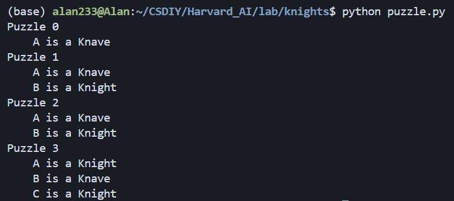

    - 主要考验逻辑的缜密性, 想清楚每条语句的形式化表达, 应该还算容易.
  
  - Lab 4. minesweeper: 构建 knowledge-based Minesweeper Agents, 实现 AI 扫雷.

    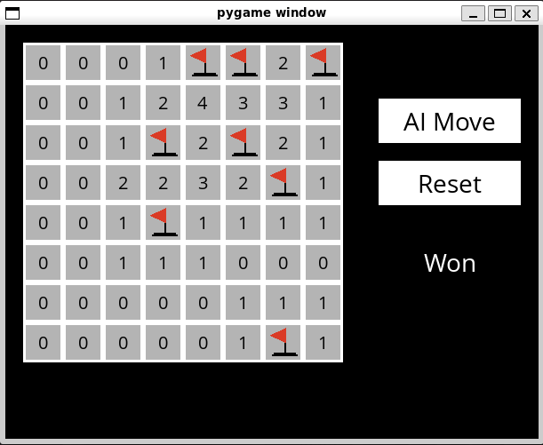

    - 核心在于 `add_knowledge` 的处理, 每次新加一条信息, 可能会导致某些信息得出 "cells 全是雷 / 安全" 的结论, 也可能导致两个信息间存在子集关系, 可以作差得到更小规模的信息, 并且可能连锁反应, 需要一直迭代, 直到得不到有效信息.

  - Lab 5. pagerank: 很经典的 Google 搜索引擎的网页"重要性"排序方法. 
    
    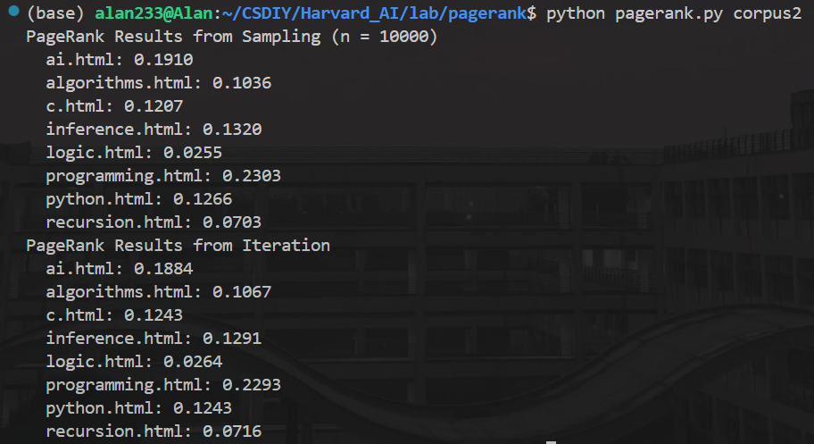

    - 该 lab 采用了两种方式, 一种是依概率采样 10000 次, 一种是迭代足够多轮直至**一致收敛**.
  
  - Lab 6. heredity: 疾病遗传, 给出家族图谱 (每个人的父母, 是否有疾病, 可能未知), 在 Bayesian Network 上使用 rejection sampling 进行估计所有人可能的**显性基因条数** (即概率分布), 以及有疾病的概率.
    
    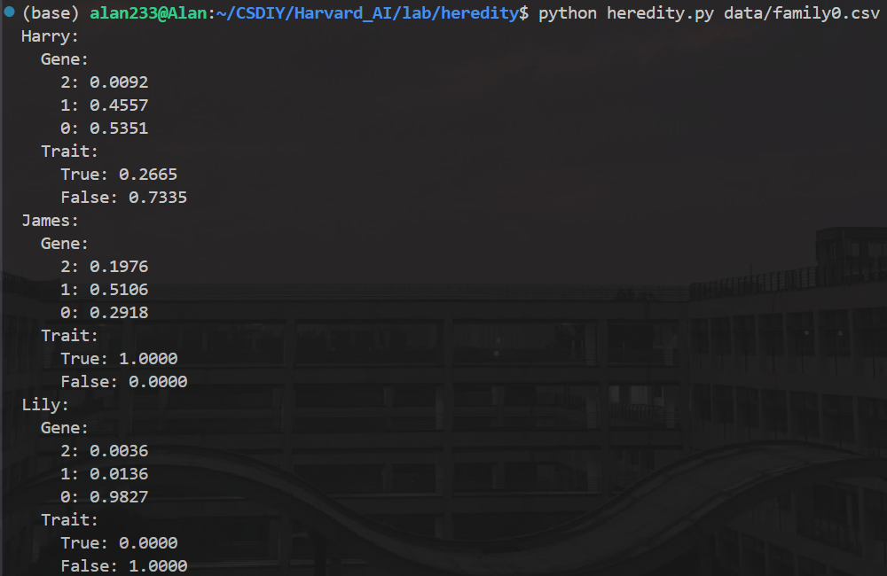

    - 因为数据集较小, 所以 `main` 函数部分 $3^{人数}\times 2^{未知疾病人数}$ 枚举所有可能性, 但事实上如果数据集较大, 我们可以依概率进行采样计算.
    - 核心是 `joint_probability` 的计算, 弄懂这一块应该就彻底 get 到贝叶斯网络的精髓了.
  
  - Lab 7. crossword: 经典的填词游戏, 给定地图和单词集, 将问题抽象成 Constraint Satisfaction Problem (CSP), 通过启发式搜索寻找一个可行解.
    
    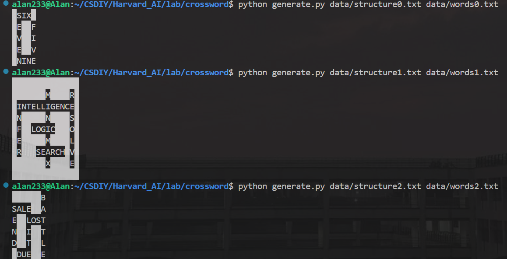

    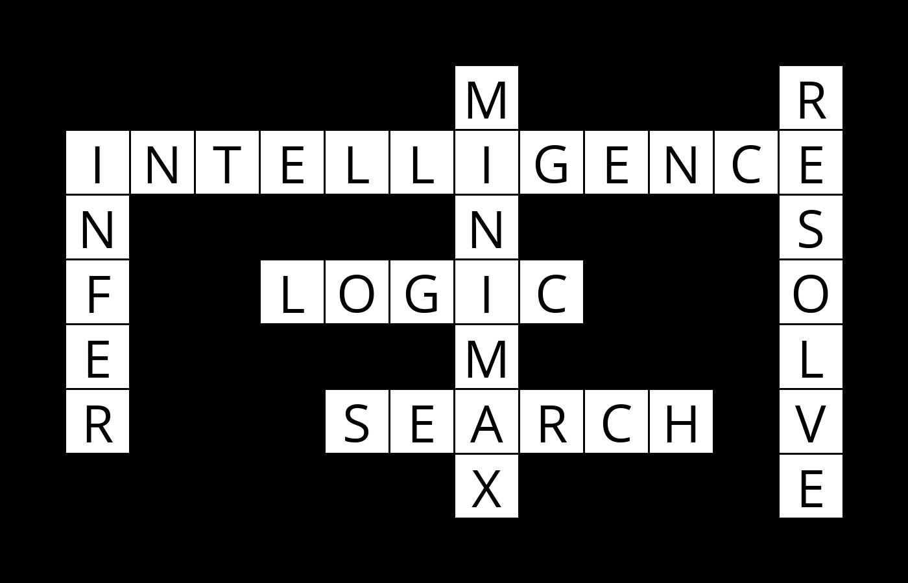

    - 一个比较复杂的 lab, 需要补全 8 个函数.

    - 将每一条 (行/列) 视做一个 `Variable`, 用 `domains` 记录每个 `Variable` 目前还可填的单词集合. 那么它需要满足 unary-consistency 和 arc-consistency. 在本题, unary 即单词长度得等于条的长度; arc 即两个 `Variable` 交叉的格子字母得一致. 
    
    - 使用 `ac3` 算法实现 `domains` 的更新.
    - 在 `backtrack` 的过程中, 我们采用两个启发式算法, 一个是 `select_unassigned_variable` 选择当前处理哪个 `Variable`, 另一个是 `order_domain_values` 对当前可填的单词进行排序 (按该顺序依次穷举). 实测这两个乱取跑的似乎也飞快, 当然我后来改成启发式实现了, 跑了几组数据都没啥问题.
  
  - Lab 8. shopping: 使用 KNN 算法, 预测线上商城顾客是否会选择购物.
  
    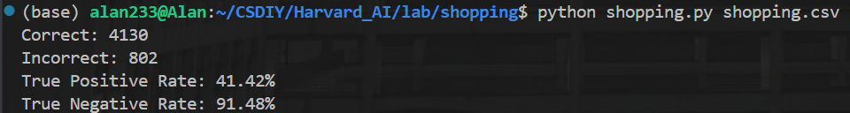

    - 需要自己手动完成数据集的创建 (`load_data` 部分), 并将其中的 $0.4$ 划为验证集, 剩余 $0.6$ 划为训练集.
    
    - 该 lab 中 $K=1$ (因此就是选取最近的点的标签), 调 scikit 的 `KNeighborsClassifier` 库, 有现成的 KNN 实现 (虽然手动实现也很容易). 值得一提的是, KNN 本身并没有任何可学习的参数, 训练集只不过是加载进去放在那里, 没进行任何 training, 就拿来直接 infer 了. 
  
  - Lab 9. nim: 使用 RL 中的 Q-Learning 算法, 让 AI 自己学会玩 nim 游戏.
    
    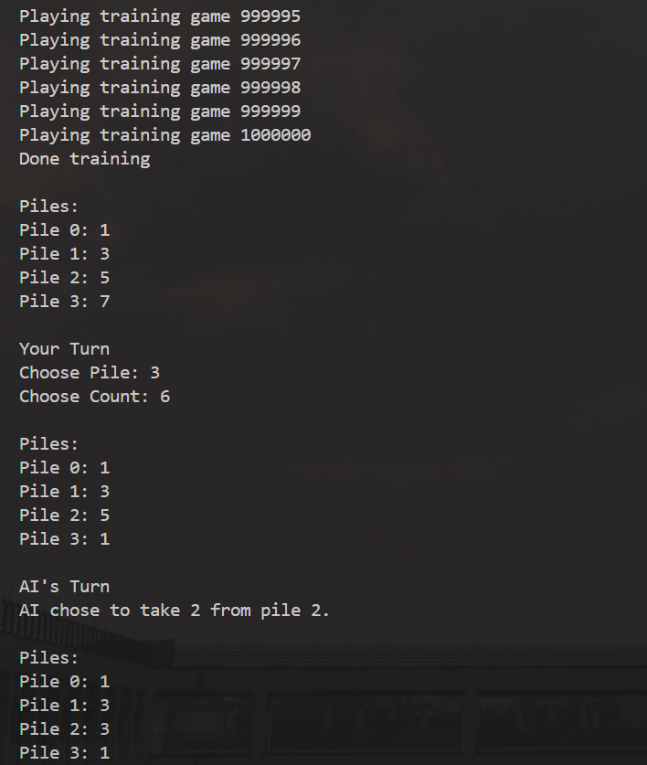

    - 这里的 nim 游戏似乎跟我理解的不太一样, 它现在是说谁取走最后一个石子谁输. 不过结论是类似的, 只有全 $1$ 的 corner case. 初始给的是 $[1,3,5,7]$, 理论上先手必败.
    - 为了测试 AI 的聪明程度, 我把训练局数调到了 $10^6$, 然后让 human 先手, AI 后手, 实测 AI 很牛.
  
  - Lab 10. traffic: 使用 tensorflow 套件、GTSRB 数据集 (德国交通信号指示牌 bench), 训练一个能对交通指示牌进行分类的 model.
    
    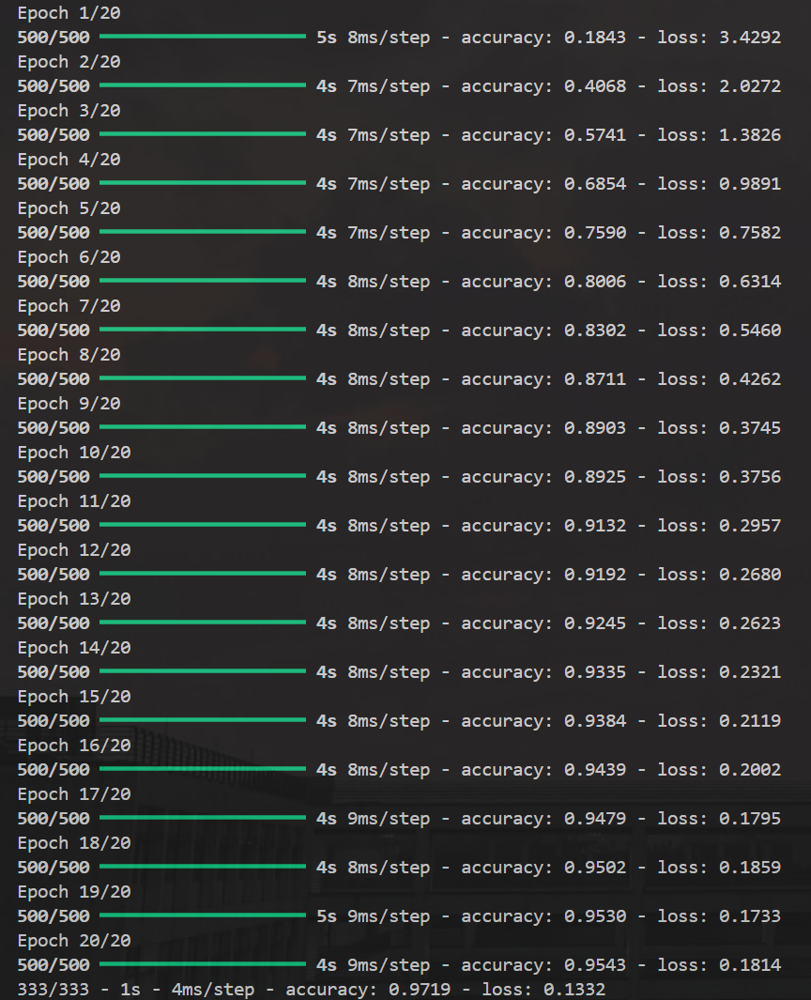

  - Lab 11. parser: 使用 nltk 库, use the context-free grammar formalism to parse English sentences，实现：

    - 句子的分词与预处理

    - 使用 ChartParser 解析句子并生成语法树

    - 对解析树进行遍历，提取最小的名词短语 (noun phrase chunks)
    
    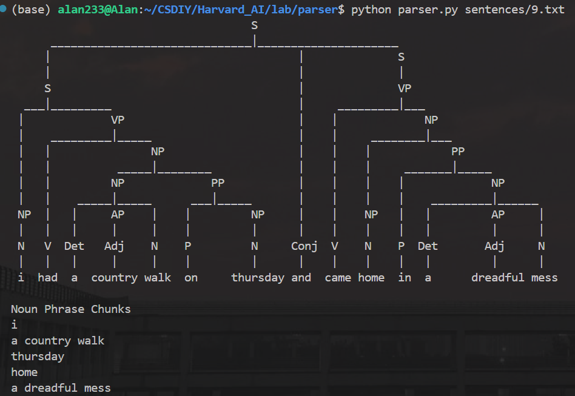

  - Lab 12. attention: 使用 Bert 模型, 对含有一个 [MASK] 的句子进行预测, 并输出每个 layer、每个 head 的注意力分布.
    
    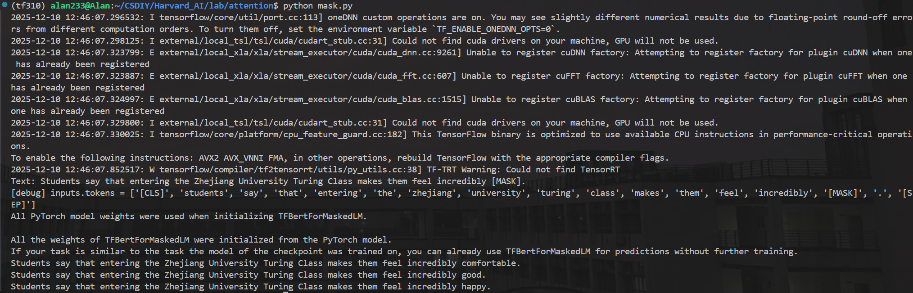

    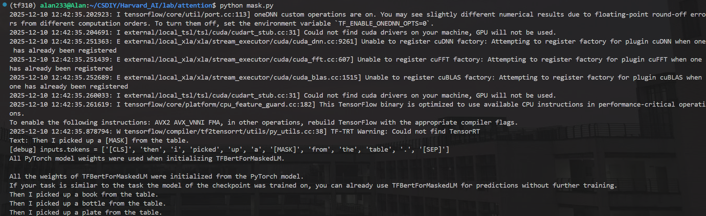

    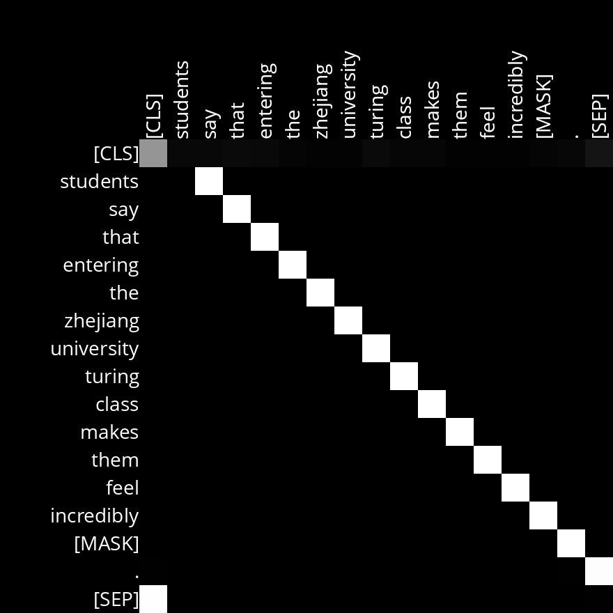

    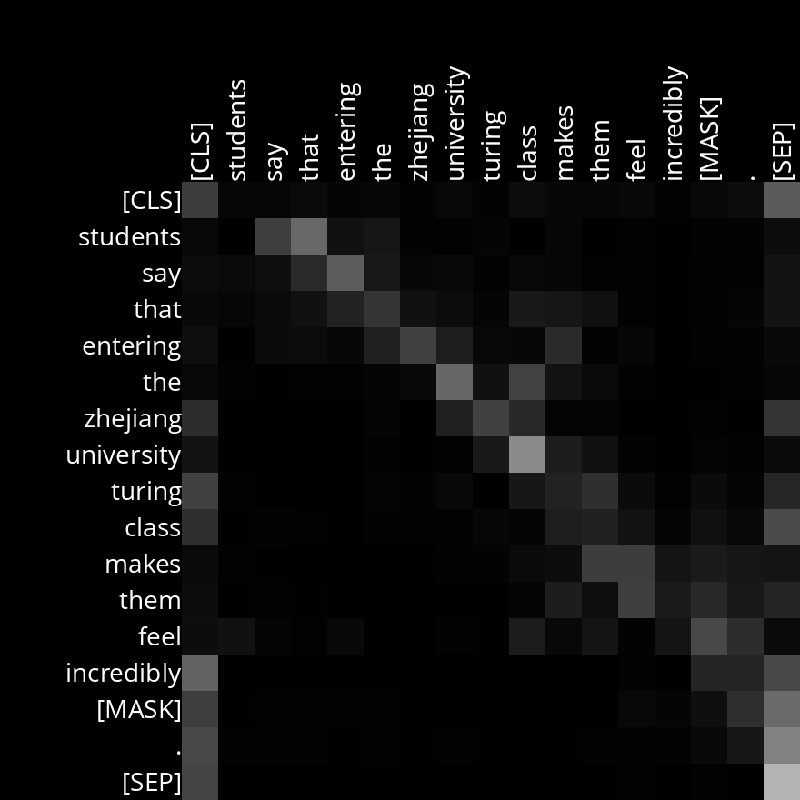
    
    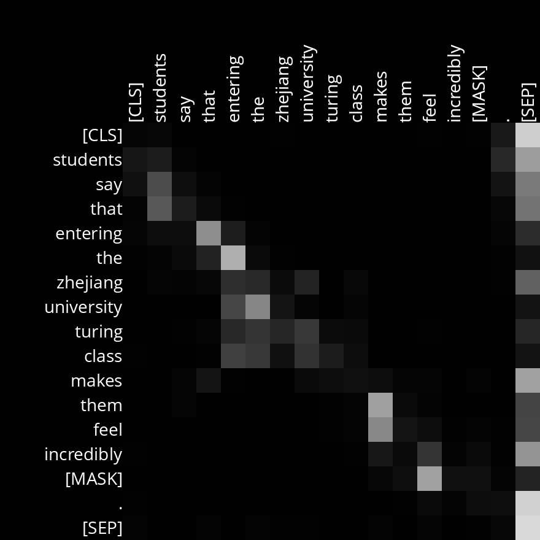

    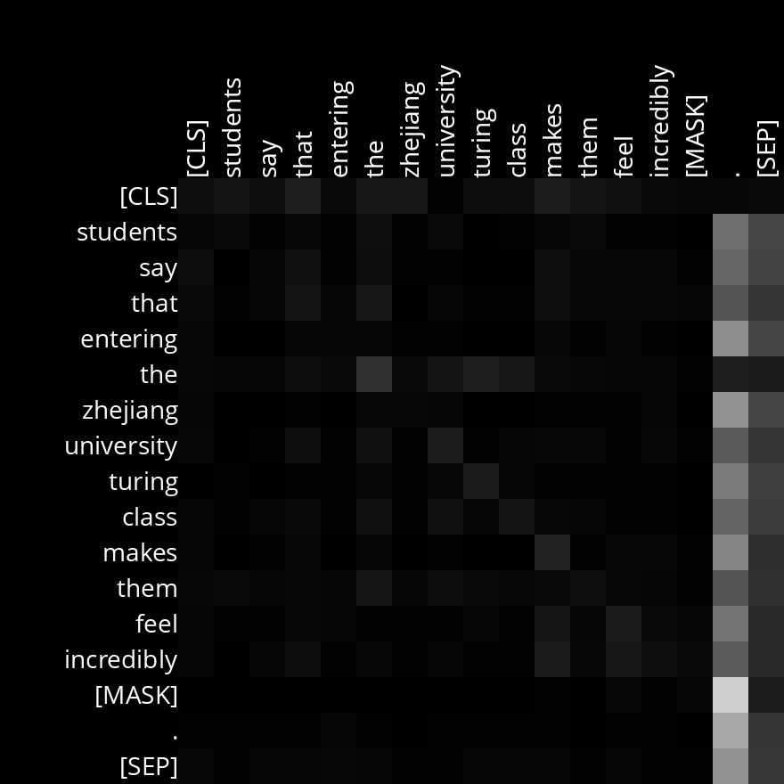

    - BERT-base 有 12 层 encoder。每一层的作用相当于一次 “信息加工”：

      - 低层（1–3 层）：学浅层模式（如词序、局部依赖关系、标点、子词结构）

      - 中层（4–8 层）：学语法（如主谓关系、指代、成分结构）

      - 高层（9–12 层）：学语义（如句子含义、代词指向、mask 填词逻辑）

    - 因此 layer 越靠前，注意力通常越局部越“规则”；layer 越靠后，注意力越抽象、越“语义化”、越难直接从图里看出规律。
    
    - 因为单一 attention “注意一个方向” 太弱。多个 heads 可以让模型同时关注不同维度的语言特征。例如在同一层里：

      - head 1：关注下一个词（你看到的模式）

      - head 2：关注前一个词

      - head 3：关注句子开头 [CLS]

      - head 4：关注动词

      - head 5：关注句子的关键名词

      - head 6：关注句子的某个特定语义主题