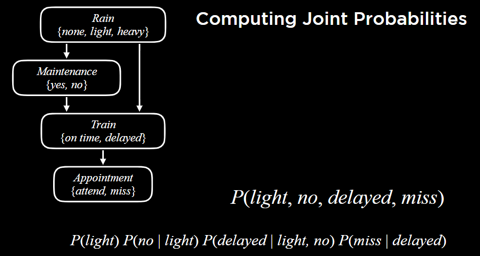
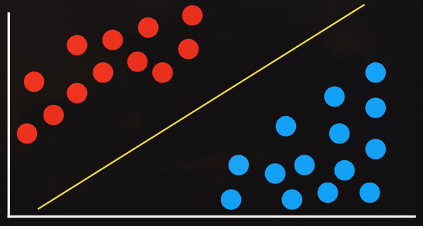
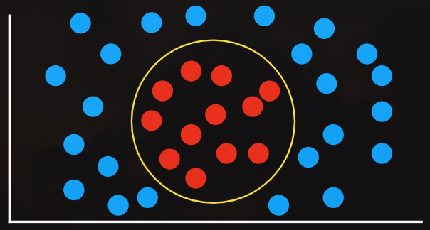
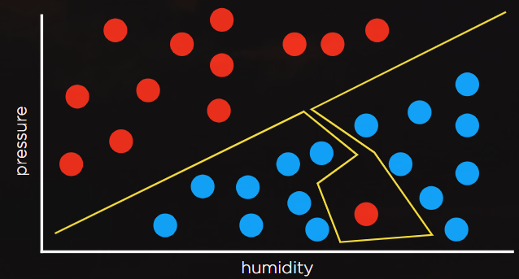
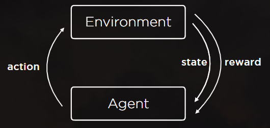

本身就会的东西就不记录了, 这里写一点新学到的.

## Lec 0. Search

### A* Search

search algorithm that expands node with lowest value of $g(n)+h(n)$.

- $g(n)$ = cost to reach node
- $h(n)$ = estimated cost to goal 

optimal if:
- $h(n)$ is admissible (never overestimates the true cost)
- $h(n)$ is consistent (for every node $n$ and successor $n'$ with step cost $c$, $h(n) \le h(n')+c$)

### Adversarial Search: Minimax & Alpha-beta pruning

Given a state $s$:
- $\text{MAX}$ picks action $a$ in $\text{ACTIONS}(s)$ that produces highest value of $\text{MIN-VALUE}(\text{RESULT}(s,a))$.
- $\text{MIN}$ picks action $a$ in $\text{ACTIONS}(s)$ that produces smallest value of $\text{MAX-VALUE}(\text{RESULT}(s,a))$.

```
function MAX-VALUE(state):
    if TERMINAL(state):
        return UTILITY(state)
    v = -infinity
    for action in ACTIONS(state):
        v = MAX(v, MIN-VALUE(RESULT(state, action)))
    return v

function MIN-VALUE(state):
    if TERMINAL(state):
        return UTILITY(state)
    v = infinity
    for action in ACTIONS(state):
        v = MIN(v, MAX-VALUE(RESULT(state, action)))
    return v
```

---

## Lec 1. Knowledge (都是些概念性的东西)

- sentence: an **assertion** about the world in a knowledge representation language.
- model: assignment of a truth value to every propositional symbol.
  - eg. $P$: It is raining; $Q$: It is a Tuesday. Model: {$P$ = `true`, $Q$ = `false`}.
- Entailment：$\alpha ⊨ \beta$. In every model in which sentence $\alpha$ is `true`, sentence $\beta$ is also `true`.
- Inference: the process of deriving new sentences from old ones.

- Search Problems:
    - initial state: starting knowledge base
    - actions: inference rules
    - transition model: new knowledge base after inference
    - goal test: check statement we're trying to prove
    - path cost function: number of steps in proof
- To determine if $\text{KB} ⊨ \alpha$:
    - Check if $(\text{KB} ∧ \neg \alpha)$ is a contradiction. If so, then entailment.

- First-Order Logic (一阶谓词):
    - Universal Quantification: $\forall$
    - Existential Quantification: $\exists$

---

## Lec 2. Uncertainty

这一讲比较简单. 但是贝叶斯网络、马尔可夫网络的可视化做得真的好!

- independence: the knowledge that one event occurs does not affect the probability of the other event.
    - $P(AB)=P(A)P(B)$, aka. $P(A)=P(A | B)$.
- Bayes' Rule:

    $$
    P(B|A)=\frac{P(A|B)P(B)}{P(A)}
    $$
- Conditioning:

    $$
    P(A)=P(A|B)P(B)+P(A|\neg B)P(\neg B)
    $$

- Bayesian Networks
    - directed graph
    - each node represents a random variable
    - arrow from $X$ to $Y$ means $X$ is a parent of $Y$
    - each node $X$ has probability distribution $P(X| \text{Parent}(X))$

    

    - Inference by Enumeration

        $$
        P(X|e) = \alpha P(X,e)=\alpha \sum_y P(X,e,y)
        $$

        where $X$ is the query variable, $e$ is the evidence. $y$ ranges over values of hidden variables, and $\alpha$ normalizes the result.

    - Approximate Inference

        - 根据概率 sampling 即可.
        - 如果本身有观测值 (evidence), 执行 rejection sampling (很好理解吧, 把观测值对不上的样本过滤了).
     - Likelihood Weighting (似然加权采样, 重要性采样)
        - start by fixing the values for evidence variables.
        - sample the non-evidence variables using conditional probabilities in the Bayesian Network.
        - Weight each sample by its **likelihood**: the probability of all of the evidence. 相当于每个样本带上了一个权重.

- Hidden Markov Model: a Markov model for a system with hidden states that generate some observed event.

---

## Lec 3. Optimization

- Linear Programming Algorithms:
  - Simplex
  - Interior-Point

- Constraint Satisfaction Problem (CSP):
  - Set of variables $\{x_1,x_2,\cdots,x_n\}$
  - Set of domains for each variable $\{D_1,D_2,\cdots,D_n\}$
  - Set of constraints $C$

- hard constraints: constraints that must be satisfied in a correct solution
- soft constraints: constraints that express some notion of which solutions are preferred over others

---

## Lec 4. Learning

这堂课我将其划分为 supervised learning, reinforcement learning, unsupervised learning.


- supervised learning: given a data set of input-output pairs, learn a function to map inputs to outputs.

- nearest-neighbor classification: algorithm that, given an input, chooses the class of the nearest data point to that input. 就是说, 每次新增一个数据, 选择离它最近的数据, 分配跟它同一个类别。
    - k-nearest-neighbor classification (KNN): chooses the most common class out of the $k$ nearest data points to that input.

- perceptron learning:
  - Weight vector $\bold{w}=(w_0,w_1,w_2)$, Input vector $\bold{x}=(1,x_1,x_2)$
  - $h_{\bold{w}}(\bold{x})=[\bold{w}\cdot \bold{x} \ge 0]$.
  - rule: Given data point $(\bold{x},y)$, update each weight according to $w_i\leftarrow w_i+\alpha (y-h_{\bold{w}}(\bold{x}))\times x_i$.

- Support Vector Machines:
  
  

  

  - **maximum margin separator**: boundary that maximizes the distance between any of the data points. 也就是找一条线划分两个类别, **最大化** 线与点集的最近距离. 注意不一定要求线性, 曲线也可以.

- regression: supervised learning task of learning a function mapping an input point to a continuous value.

- overfitting: a model that fits too closely to a particular data set and therefore may fail to generalize to future data.
  
  
  
  比如这样, 很明显本来一条线就挺好的, 但过拟合导致陷进去了这么多.

- regularization: penalizing hypotheses that are more complex to favor simpler, more general hypotheses
  
  $$
  \text{cost}(h)=\text{loss}(h)+\lambda \cdot \text{complexity}(h)
  $$

- holdout cross-validation: splitting data into a **training set** and a **valid set**, such that learning happens on the training set and is evaluated on the valid set.
  - k-fold cross-validation: splitting data into $k$ sets, and experimenting $k$ times, using each set as a valid set once, and using remaining data as training set.

---

- reinforcement Learning: given a set of rewards or punishments, learn what actions to take in the future.
  
  

  - Markov Decision Process: model for decision-making, representing states, actions, and their rewards.
    - Set of states $S$
    - Set of actions $\text{ACTIONS}(s)$
    - Transition model $P(s'|s,a)$
    - Reward function $R(s,a,s')$

  - Q-learning: method for learning a function $Q(s,a)$, estimate of the value of performing action $a$ in state $s$.
    - Start with $Q(s,a)=0$ for all $s,a$.
    - When we taken an action and receive a reward:
      - Estimate the value of $Q(s,a)$ based on current reward and expected future rewards
      - Update $Q(s,a)$ to take into account old estimate as well as our new estimate
      
      $$
      Q(s,a)\leftarrow Q(s,a)+\alpha (\text{new value estimate}-\text{old value estimate})
      $$

      即:

      $$
      Q(s,a)\leftarrow Q(s,a)+\alpha ((r+\text{future reward estimate})-Q(s,a))
      $$

      其中 $\text{future reward estimate}$ 可以用 $\gamma \cdot \max_{a'} Q(s',a')$ 来估计.

  - Greedy Decision-Making: When in state $s$, choose action $a$ with highest $Q(s,a)$.
  
  - $\varepsilon$ - greedy: **Explore vs. Exploit** 
    - Set $\varepsilon$ equal to how often we want to move randomly.
    - With probability $1-\varepsilon$, choose estimated best move.
    - With probability $\varepsilon$, choose a random move.

---

- unsupervised learning: given input data without any additional feedback, learn patterns

- clustering: organizing a set of objects into groups in such a way that similar objects tend to be in the same group.
  - k-means clustering: algorithm for clustering data based on repeatedly assigning points to clusters and updating those clusters' centers.