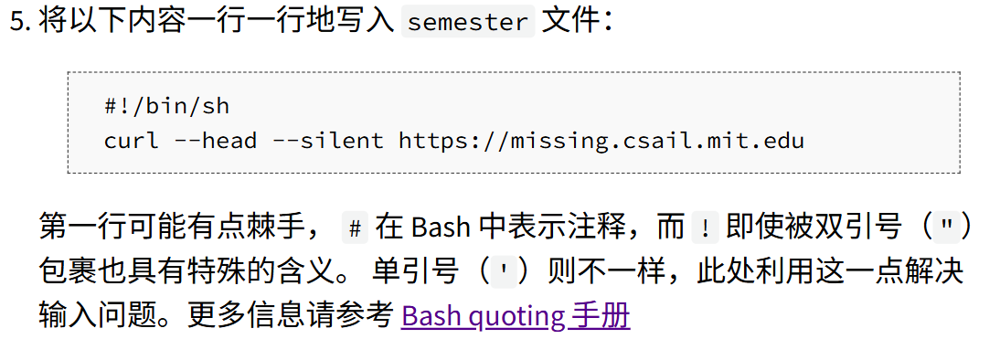
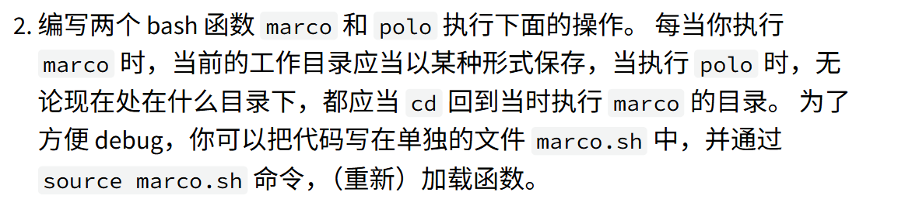
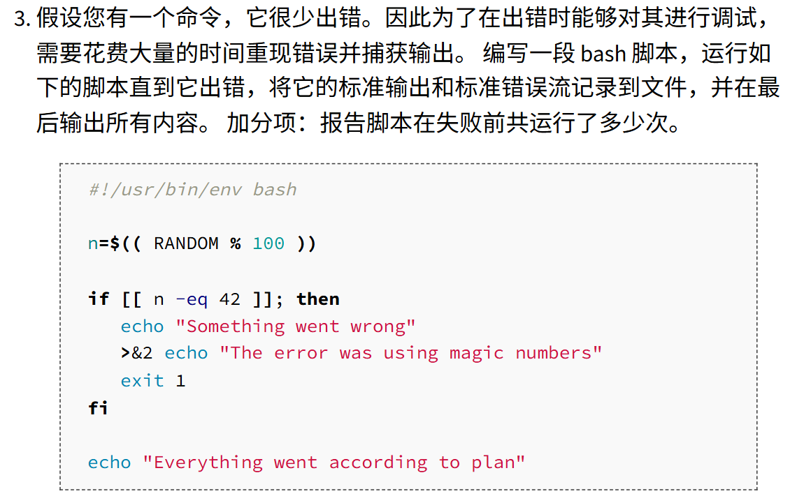

## Homework 1



```bash
alan233@Alan:/tmp/missing$ echo '#!/bin/sh' > semester
alan233@Alan:/tmp/missing$ echo 'curl --head --silent https://missing.csail.mit.edu' >> semester
alan233@Alan:/tmp/missing$ cat semester
#!/bin/bash
curl --head --silent https://missing.csail.mit.edu
```


```bash
alan233@Alan:~$ cat /sys/class/power_supply/BAT1/capacity
100
```

## Homework 2



```bash
alan233@Alan:~$ touch marco.sh
alan233@Alan:~$ vim marco.sh
#!/bin/bash
marco() {
    echo "$(pwd)" > $HOME/marco_history.log
}
polo() {
    cd "$(cat $HOME/marco_history.log)"
}
alan233@Alan:~$ source marco.sh
alan233@Alan:~$ cd hello
alan233@Alan:~/hello$ marco
alan233@Alan:~/hello$ cd ~
alan233@Alan:~$ polo
alan233@Alan:~/hello$
```



```bash
alan233@Alan:~$ vim buggy.sh
#!/usr/bin/env bash
n=$((RANDOM % 100))

if [[ n -eq 42 ]]; then
    echo "Something went wrong"
    >&2 echo "The error was using magic numbers"
    exit 1
fi

echo "Everything went according to plan"
alan233@Alan:~$ vim debug.sh
#!/usr/bin/env bash
count=0
echo > out.log

while true; do
    ./buggy.sh &>> out.log
    if [[ $? -ne 0 ]]; then
        cat out.log
        echo "failed after $count times"
        break
    fi
    ((count++))
done
alan233@Alan:~$ chmod 777 debug.sh
alan233@Alan:~$ ./debug.sh

Everything went according to plan
Everything went according to plan
Everything went according to plan
Everything went according to plan
Everything went according to plan
Everything went according to plan
Everything went according to plan
Everything went according to plan
Everything went according to plan
Everything went according to plan
Everything went according to plan
Everything went according to plan
Everything went according to plan
Something went wrong
The error was using magic numbers
failed after 13 times
```


```bash
alan233@Alan:~/CSDIY$ find . -type f -mtime -1 | xargs -d '\n' ls -lt | head -n 1
-rw-r--r-- 1 alan233 alan233   2055 Nov 16 01:00 ./MIT_shell/homework/homework.md
```