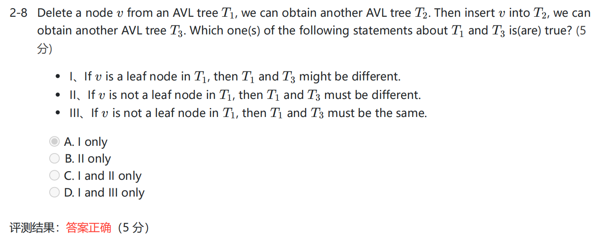
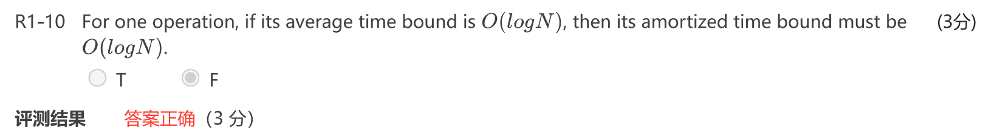

同样是一个数据结构, 不同的人会有不同的实现, 但这门课框定了每一种 ds 的教科书式"标准写法", 非常死板还要拿来出成选择题考. 因此从实用的层面上, 我在笔记中会标明, 哪些是干货需要掌握, 哪些纯粹是为了应付考试 (或者说写法其实不一, 不必逢其为金科玉律来记背).

## Lec 1. AVL Tree, Splay Tree, Amortized Analysis

- AVL 的平衡因子 (balance factor) 指的是左儿子的 Height 减去右儿子的 Height, 要求控制在 $[-1,1]$.
 

- 注意区分 average time 和 amortized time: average time 是期望时间复杂度, 也就是说平均情况下复杂度不高, 但可能会存在某些特殊情形让复杂度特别高. 而 amortized time 考虑的是最坏情况下的均摊成本, 需要顾及所有可能的情形.
    

## Lec 2. Red Black Tree, B+ Tree

- 对于红黑树的删除操作, 它的旋转次数是 $O(1)$ 的, 具体(应该)不超过 $3$ 次. 仔细看看.

## Lec 3. Inverted File Index (倒排索引)

- 主要是一个流程
- precision, recall 的概念

## Lec 4. Leftist Heap, Skew Heap

- 有一句很幽默的话: The relationship of skew heaps to leftist heaps is **analogous** (类似的) to the relation between splay trees and AVL trees. 确实有道理, 斜堆抛弃了 NPL, 强行 swap; Splay 抛弃了 Height, 强行 access 到根.

## Lec 5. Binomial Queue (二项堆)

- 对于一棵 Binomial Tree, 每个结点的儿子按照子树大小**从大到小**排序. 这是因为它不是一棵二叉树, 得采用"左儿子右兄弟"的方式存储. 在每次 merge 时, 两棵 $B_k$ 的一个根成为到另一个根最大的儿子, 若顺序排列需要 $O(k)$ 遍历到最后一个儿子, 若倒序排列即可 $O(1)$ 合并.

## Lec 6. Backtracking

- $\alpha-\beta$ 减枝, 注意理解原理.
    

## Lec 7. Divide and Conquer

- 主定理, 还是挺复杂的. 待填充.