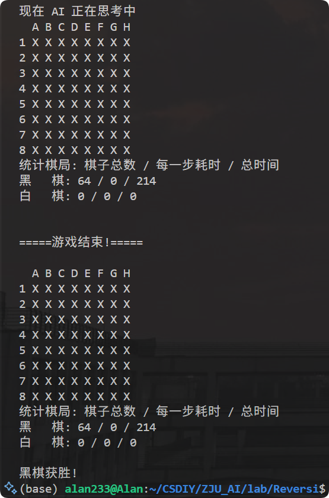

## ZJU_AI (Artificial Intelligence)

- CS 2065M: 人工智能引论
- 学分: 3.5
- 任课教师: 吴飞
- 修读学期: 2025-2026, 大二秋冬

- 课程实验:
  - lab 2. Reversi
    
    - 使用蒙特卡洛树搜索算法, 实现一个**黑白棋 (Reversi)** 的人机交互 / 机机交互程序. 实测该 AI 的下棋本领较为高超.