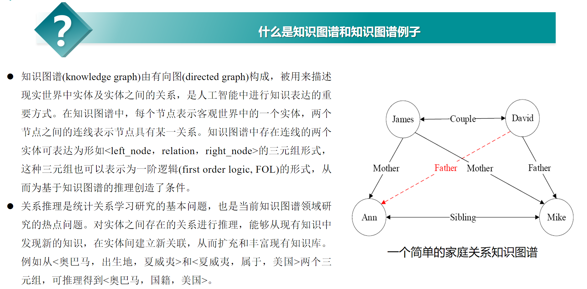
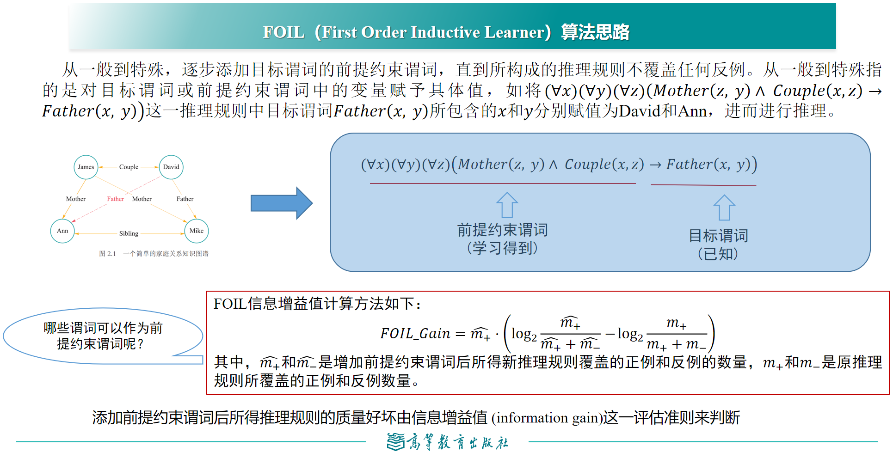
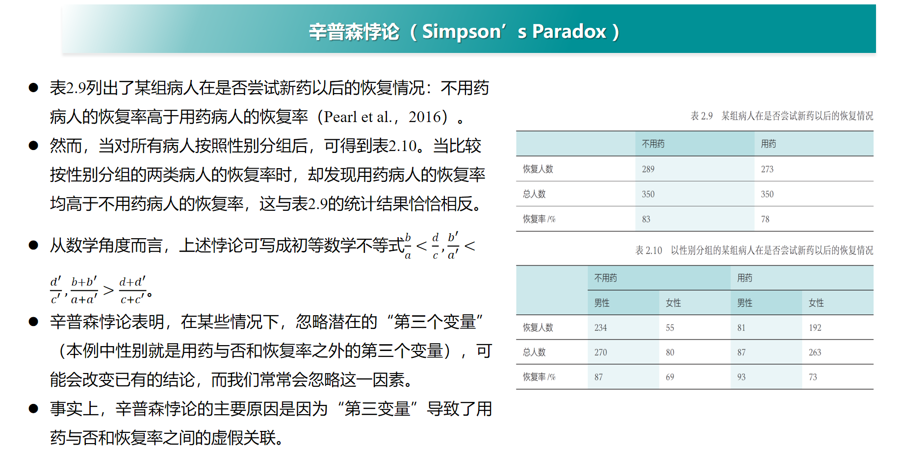
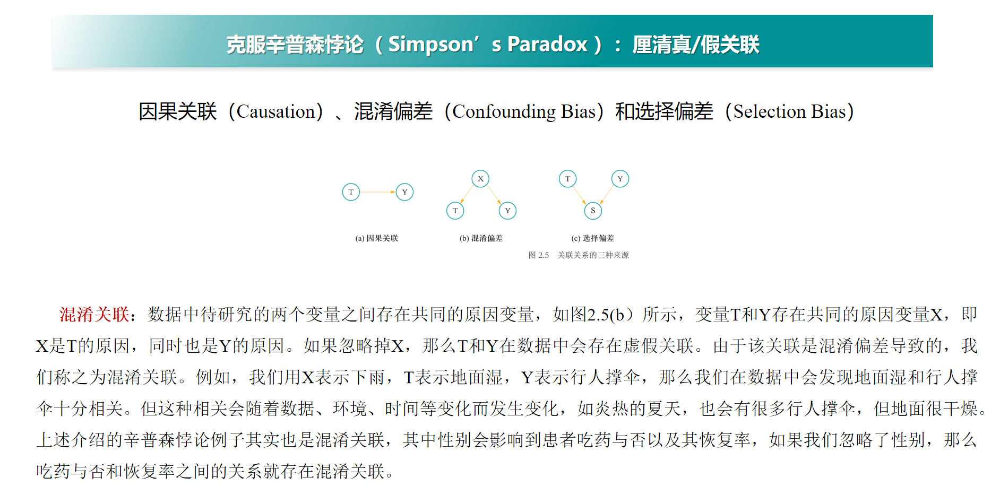
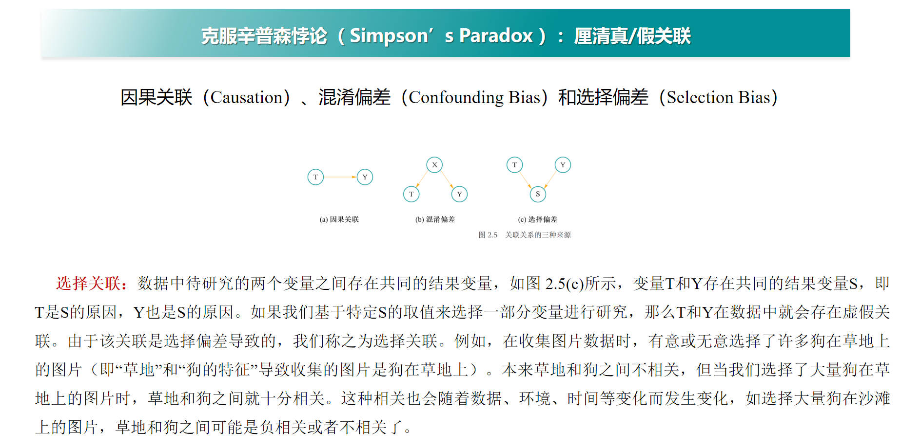
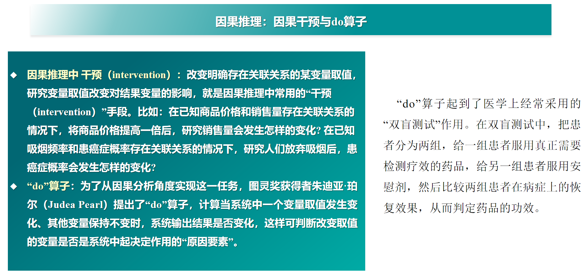

## 期末周前必读

期末考试占比: 填空 40 分 (1 分一个, 有备选项), 单选 30 分 (1.5 分一个), 简答 30 分 (5 分一个). 考察的大部分是概念, 有少部分计算但并不困难, 主要考 PPT 上的概念和例子.

黄正行老师在 22 级人工智能基础的最后一节复习课上有划重点, 附带真题讲解.

- 中国大学 mooc 上「人工智能导论：模型与算法」课程测试题与答案: https://blog.csdn.net/a66666_/article/details/105123032

---

## 人工智能绪论

- "A Proposal for the Dartmouth Summer Research Project on Artificial Intelligence" (人工智能达特茅斯夏季研究项目建议书), 首次使用了 "Artificial Intelligence" 这一术语, 从此人工智能开始登上了人类历史舞台.
- 原始递归函数、$\lambda$-验算、图灵机展现了"可计算"的概念.

## 知识表达与推理

- 命题: 确定为真 / 假的陈述句.
- 原子命题: 不包含其他命题作为其组成部分的命题, 又称简单命题.
- 逻辑等价: 具有相同的真假结果, 用 $\equiv$ 表示.
- 知识图谱:
  
- FOIL (First Order Inductive Learner) 算法:
  - 构造目标谓词 $P$ 的训练样例, 包含**正例集合 $E^+$ **和**反例集合 $E^-$**.
  
- 路径排序推理 (PRA) 算法: 看不懂, 写的啥玩意, 回头补天.

### 概率图谱推理

一般有**贝叶斯网络 (Bayesian Network)** 和**马尔可夫网络 (Markov Network)**.

- 贝叶斯网络: 满足**局部马尔可夫性**, 即在给定一个节点的父节点的情况下, 该父亲节点有条件地独立于它的非后代节点. 换言之, 网络中所有因素的联合分布等于所有节点的 P(节点 | 父节点) 的乘积.
  - P(多云、下雨、洒水车、路湿)=P(多云)P(洒水车|多云)P(下雨|多云)P(路湿|洒水车,下雨)

- 马尔可夫网络: 给定一个由若干规则构成的集合, 集合中每条推理规则赋予一定权重 $w$, 则可如下计算某个断言 $x$ 成立的概率:

    $$
    P(X=x)=\frac{1}{Z} \exp \left( \sum_i w_i n_i(x)\right)
    $$
    其中 $n_i(x)=0/1$ 表示在推导 $x$ 中所涉及第 $i$ 条规则的逻辑取值 (真/假), $w_i$ 是该规则对应的权重, $Z$ 是固定常量, 比较显然为:
    $$
    Z=\sum_{x \in \mathcal X} \exp \left( \sum_i w_i n_i(x)\right)
    $$
### 因果推理

- 辛普森悖论, 混淆偏差, 选择偏差:
  
  
  
- 因果干预, do 算子:
  
