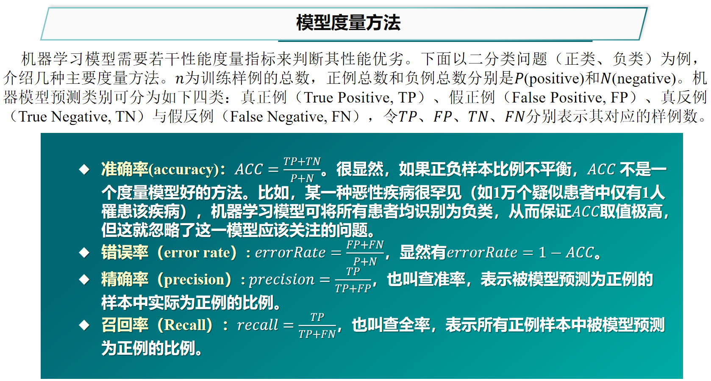
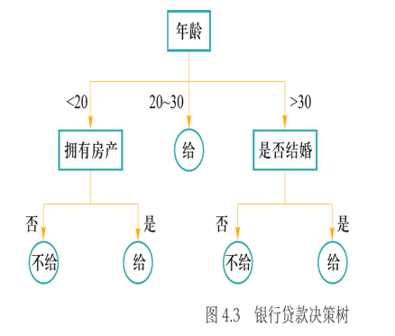
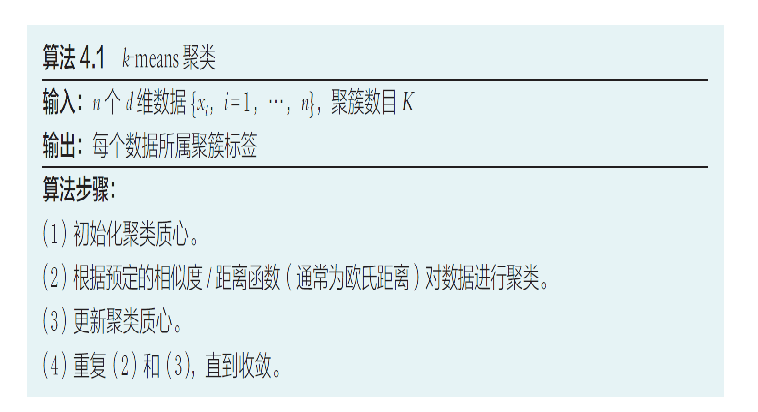
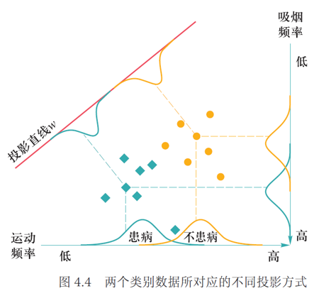

## 期末周前必读

期末考试占比: 填空 40 分 (1 分一个, 有备选项), 单选 30 分 (1.5 分一个), 简答 30 分 (5 分一个). 考察的大部分是概念, 有少部分计算但并不困难, 主要考 PPT 上的概念和例子.

黄正行老师在 22 级人工智能基础的最后一节复习课上有划重点, 附带真题讲解.

- 中国大学 mooc 上「人工智能导论：模型与算法」课程测试题与答案: https://blog.csdn.net/a66666_/article/details/105123032

---

## 人工智能绪论

- "A Proposal for the Dartmouth Summer Research Project on Artificial Intelligence" (人工智能达特茅斯夏季研究项目建议书), 首次使用了 "Artificial Intelligence" 这一术语, 从此人工智能开始登上了人类历史舞台.
- 原始递归函数、$\lambda$-验算、图灵机展现了"可计算"的概念.

## 知识表达与推理

- 命题: 确定为真 / 假的陈述句.
- 原子命题: 不包含其他命题作为其组成部分的命题, 又称简单命题.
- 逻辑等价: 具有相同的真假结果, 用 $\equiv$ 表示.
- 知识图谱:
  
- FOIL (First Order Inductive Learner) 算法:
  - 构造目标谓词 $P$ 的训练样例, 包含**正例集合 $E^+$ **和**反例集合 $E^-$**.
  
- 路径排序推理 (PRA) 算法: 看不懂, 写的啥玩意, 回头补天.

### 概率图谱推理

一般有**贝叶斯网络 (Bayesian Network)** 和**马尔可夫网络 (Markov Network)**.

- 贝叶斯网络: 满足**局部马尔可夫性**, 即在给定一个节点的父节点的情况下, 该父亲节点有条件地独立于它的非后代节点. 换言之, 网络中所有因素的联合分布等于所有节点的 P(节点 | 父节点) 的乘积.
  - P(多云、下雨、洒水车、路湿)=P(多云)P(洒水车|多云)P(下雨|多云)P(路湿|洒水车,下雨)

- 马尔可夫网络: 给定一个由若干规则构成的集合, 集合中每条推理规则赋予一定权重 $w$, 则可如下计算某个断言 $x$ 成立的概率:

    $$
    P(X=x)=\frac{1}{Z} \exp \left( \sum_i w_i n_i(x)\right)
    $$
    其中 $n_i(x)=0/1$ 表示在推导 $x$ 中所涉及第 $i$ 条规则的逻辑取值 (真/假), $w_i$ 是该规则对应的权重, $Z$ 是固定常量, 比较显然为:
    $$
    Z=\sum_{x \in \mathcal X} \exp \left( \sum_i w_i n_i(x)\right)
    $$
### 因果推理

- 辛普森悖论, 混淆偏差, 选择偏差:
  
  
  
- 因果干预, do 算子:
  

## Lec 4. 机器学习

### 基本概念

- 机器学习通过对数据的优化学习, 建立能够刻画数据中所蕴含语义概念或分布结构等信息的模型. 机器学习可划分为监督学习 (supervised learning)、无监督学习 (unsupervised learning) 及半监督学习 (semi-supervised learning).

- 监督学习: 给定带有标签信息数据的训练集 $\mathcal D=\{(x_i,y_i)\}_{i=1}^n$, 学习一个从 $x_i \to y_i$ 的映射 ($x_i$ 可以是文档、图像、音频等, $y_i$ 即对应的语义内容). 监督学习算法学习得到一个最优映射函数 $f$ (又称决策函数), 实现数据的分类和识别.
- 无监督学习: 只有 $\mathcal D=\{x_i\}_{i=1}^n$.

- 泛化能力 (generalization): 在机器学习中, 需要保证模型在训练集上所取得性能和在测试集上所取得性能保持一致, 即模型具有泛化能力.
- 对于模型评估, 我们采用损失函数 $\text{loss}(f(x_i),y_i)$ 来估量预测值 $\hat{y_i}$ 和真实值 $y_i$ 之间的差异. 显然在训练时我们希望最小化 $\sum\limits_{i=1}^{n} \text{loss}(\hat{y_i},y_i)$.
- 映射函数 $f$ 在训练集上的损失函数值被称为**经验风险 $\mathcal R_{emp}$** (empirical risk), 经验风险越小则模型对训练集拟合程度越好.

$$
\mathcal R_{emp}=\frac{1}{n} \sum_{i=1}^{n} \text{loss}(\hat{y_i},y_i)
$$

- 某一任务理论上可包含的所有数据中, 模型的期望损失函数值被称为**期望风险 $\mathcal R$** (expected risk).

$$
\mathcal R=\int_{x\times y} P(x,y) \text{loss}(\hat{y},y) dxdy
$$

- 为了防止"过学习" (即“经验风险小, 期望风险大”, 模型过于复杂), 引入正则化 (regularizer) 或惩罚项 (penalty term) 来降低模型复杂度, 在经验风险、模型复杂度之间寻找平衡:

  $$
  \frac{1}{n} \sum_{i=1}^{n} \text{loss}(\hat{y_i},y_i) +\lambda J(f)
  $$

  其中 $J(f)$ 是正则化因子或惩罚项因子, $\lambda$ 是用来调整惩罚强度的系数.

- 

### 监督学习: 回归分析与决策树

- 回归分析: 分析不同变量之间存在的关系. 最简单的比如一元线性回归.
- 一元线性回归: $\hat{y}=ax+b$, 一般采用**最小二乘法**, 即 $L(a,b)=\sum\limits_{i=1}^{n} (y_i-(ax_i+b))^2$, 我们的目标是最小化该损失函数.
  
  分别对 $a,b$ 求偏导, 可以得到:
  
  $$
  \begin{align}
  a&=\frac{\sum_{i=1}^{n} x_iy_i-n \bar{x}\bar{y}}{\sum_{i=1}^{n} x_i^2 -n\bar{x}^2} 
  \notag
  \\
  b&=\bar{y}-a\bar{x}
  \notag
  \end{align}
  $$

- 多元线性回归: 设有 $m$ 个训练数据 $\{(\bold{x_i},y_i)\}_{i=1}^{m}$, 其中 $\bold{x_i}=(x_{i,1},\cdots,x_{i,D})\in \mathbb{R}^D$, $D$ 为数据特征的维度. 线性回归就是要找到一组参数 $\bold{a}=(a_0,a_1,\cdots,a_D)^T$, 使得线性函数:
  $$
  f(\bold{x_i})=a_0+\sum_{j=1}^D a_j x_{i,j}
  $$ 

  最小化均方误差函数:

  $$
  J_m(\bold{a})=\frac{1}{m} \sum_{i=1}^{m} (y_i-f(\bold{x_i}))^2
  $$

  记 $\bold{X}=(\bold{x_1},\cdots,\bold{x_m})^T$ (为方便处理常数项 $a_0$, 我们在每个 $\bold{x_i}$ 前补一个常数 $1$), $\bold{y}=(y_1,\cdots,y_m)^T$, 则 $J_m(\bold{a})=(\bold{y}-\bold{X}\bold{a})^T(\bold{y}-\bold{X}\bold{a})$. 对参数 $\bold{a}$ 求偏导得 $\frac{\partial J(\bold{a})}{\partial \bold{a}}=-2\bold{X}^T(\bold{y}-\bold{X}\bold{a})$.

  因此极小值点为 $\bold{a}=(\bold{X}^T \bold{X})^{-1}\bold{X}^T \bold{y}$.

- logistic 回归: 线性回归有一个很明显的问题是它对离群点非常敏感, 可能导致模型不稳定, 为了缓和这个问题带来的影响, 我们采用非线性回归模型. 
  
  现在引入 sigmoid 函数, 回归模型表示如下:

  $$
  y=\frac{1}{1+e^{-z}} \\

  z=\bold{w}^T \bold{x}+b
  $$

  其中 $\bold{x}\in \mathbb R^d$ 是输入数据, $\bold{w}\in \mathbb R^d$ 和 $b\in \mathbb R$ 是回归模型的参数.

  我个人认为, 这里的"回归"更像是"分类", sigmoid 得出的 $y$ 其实应该理解为概率 $p$, 也就是说有 $p$ 的概率认为是类别 $1$, $1-p$ 的概率认为是类别 $0$.

- softmax 回归: 前面 logistic 只能用于解决二分类问题, 将其推广成处理多分类问题, 那就是 softmax 回归.

- 决策树: 选择某个属性, 对样本集进行划分, 然后递归, 直至每个子样本为同一个类别 (非常类似 KD-Tree). 由此可见划分属性的顺序是很重要的, 性能好的决策树随着划分的不断进行, 分支节点样本集的"纯度"会越来越高, 即所包含的样本尽可能属于相同类别.
  
  

  如何刻画"纯度"呢? 我们引入了信息熵 (entropy), 它就是一种指标: 信息熵越大, 说明该集合的不确定性越大. 假设有 $K$ 类信息, 共同组成了集合样本 $D$. 记第 $k$ 哥信息发生的概率为 $p_k$, 定义信息熵 $Ent(D)=-\sum\limits_{k=1}^{K} p_k \log_2 p_k$.

  举个例子, 比如 $14$ 个样本中有 $9$ 个"给予贷款"、$5$ 个"不给予贷款", 那么类别数 $K=2$, 并且 $Ent(D)=-(\frac{9}{14}\cdot \log_2 \frac{9}{14}+\frac{5}{14}\cdot \log_2 \frac{5}{14})$.

  选择属性划分样本前后信息熵的减少量称为**信息增益 (information gain)**, 用于衡量样本集合复杂度 (不确定性) 减少的程度. 由此我们据此可以去寻找信息增益最大的划分方式, 不断进行递归处理, 得到优质的决策树.

### 无监督学习: K 均值聚类

- K-means 算法的目标是将 $n$ 个 $d$ 维数据 $\{\bold{x_i}\}$ 划分为 $K$ 个聚簇, 使得簇内方差最小化.

  

  初始化 $K$ 个聚类质心 $C=\{c_1,\cdots,c_K\}$, 对每个数据纳入离它最近的质心的聚类集合, 根据聚类结果一次性更新聚类质心. 不断迭代以上过程, 直到收敛.

  $$
  \arg \min_G \sum_{i=1}^{K} \sum_{x\in G_i} ||x-C_i||^2=\arg \min_G \sum_{i=1}^{K} |G_i| \text{Var}(G_i)  
  $$

  K-means 聚类就是通过最小化聚簇内的数据方差, 以此来实现最大化类内相似度的.

### 监督学习与无监督学习下的特征降维

- 线性判别分析 (linear discriminant analysis, LDA): 基于监督学习的降维方法. 对于一组高维数据样本, LDA 利用其类别信息, 将其线性投影到一个低维空间上, 使得: 在低维空间中, 同一类别的样本尽可能靠近, 不同类别的样本尽可能彼此远离.
  
  
- 