## 期末周前必读

期末考试占比: 填空 40 分 (1 分一个, 有备选项), 单选 30 分 (1.5 分一个), 简答 30 分 (5 分一个). 考察的大部分是概念, 有少部分计算但并不困难, 主要考 PPT 上的概念和例子.

黄正行老师在 22 级人工智能基础的最后一节复习课上有划重点, 附带真题讲解.

- 中国大学 mooc 上「人工智能导论：模型与算法」课程测试题与答案: https://blog.csdn.net/a66666_/article/details/105123032

---

## 人工智能绪论

- "A Proposal for the Dartmouth Summer Research Project on Artificial Intelligence" (人工智能达特茅斯夏季研究项目建议书), 首次使用了 "Artificial Intelligence" 这一术语, 从此人工智能开始登上了人类历史舞台.
- 原始递归函数、$\lambda$-验算、图灵机展现了"可计算"的概念.

## 知识表达与推理

- 命题: 确定为真 / 假的陈述句.
- 原子命题: 不包含其他命题作为其组成部分的命题, 又称简单命题.
- 逻辑等价: 具有相同的真假结果, 用 $\equiv$ 表示.
- 知识图谱:
  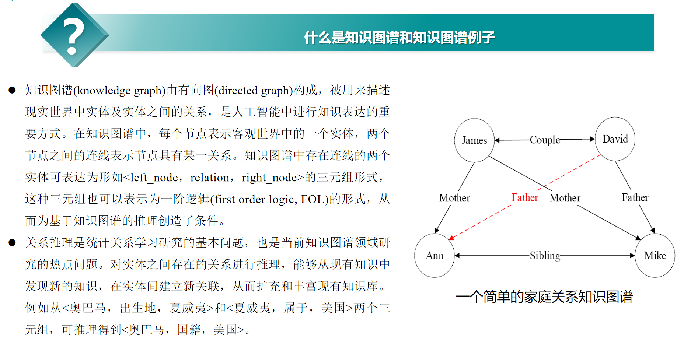
- FOIL (First Order Inductive Learner) 算法:
  - 构造目标谓词 $P$ 的训练样例, 包含**正例集合 $E^+$ **和**反例集合 $E^-$**.
  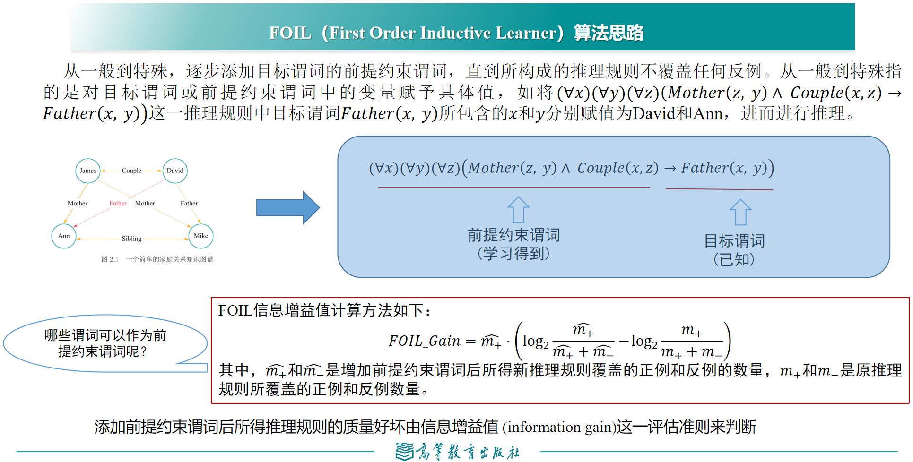
- 路径排序推理 (PRA) 算法: 看不懂, 写的啥玩意, 回头补天.

### 概率图谱推理

一般有**贝叶斯网络 (Bayesian Network)** 和**马尔可夫网络 (Markov Network)**.

- 贝叶斯网络: 满足**局部马尔可夫性**, 即在给定一个节点的父节点的情况下, 该父亲节点有条件地独立于它的非后代节点. 换言之, 网络中所有因素的联合分布等于所有节点的 P(节点 | 父节点) 的乘积.
  - P(多云、下雨、洒水车、路湿)=P(多云)P(洒水车|多云)P(下雨|多云)P(路湿|洒水车,下雨)

- 马尔可夫网络: 给定一个由若干规则构成的集合, 集合中每条推理规则赋予一定权重 $w$, 则可如下计算某个断言 $x$ 成立的概率:

    $$
    P(X=x)=\frac{1}{Z} \exp \left( \sum_i w_i n_i(x)\right)
    $$
    其中 $n_i(x)=0/1$ 表示在推导 $x$ 中所涉及第 $i$ 条规则的逻辑取值 (真/假), $w_i$ 是该规则对应的权重, $Z$ 是固定常量, 比较显然为:
    $$
    Z=\sum_{x \in \mathcal X} \exp \left( \sum_i w_i n_i(x)\right)
    $$
### 因果推理

- 辛普森悖论, 混淆偏差, 选择偏差:
  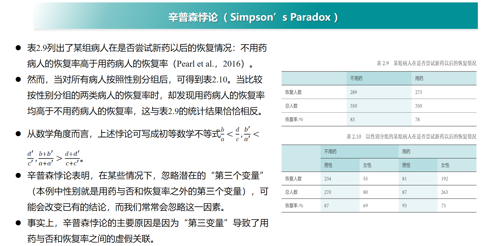
  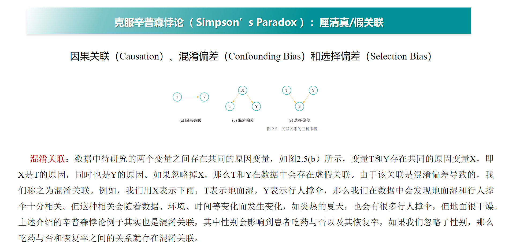
  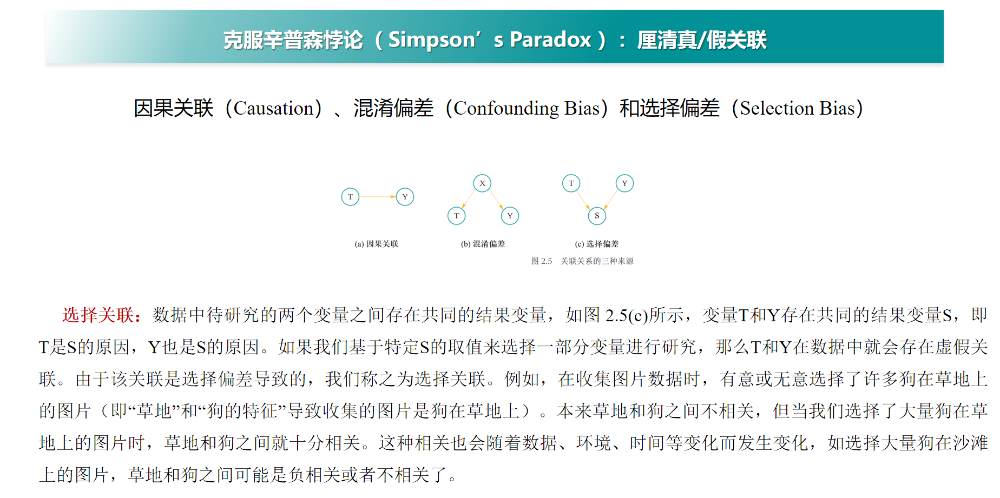
- 因果干预, do 算子:
  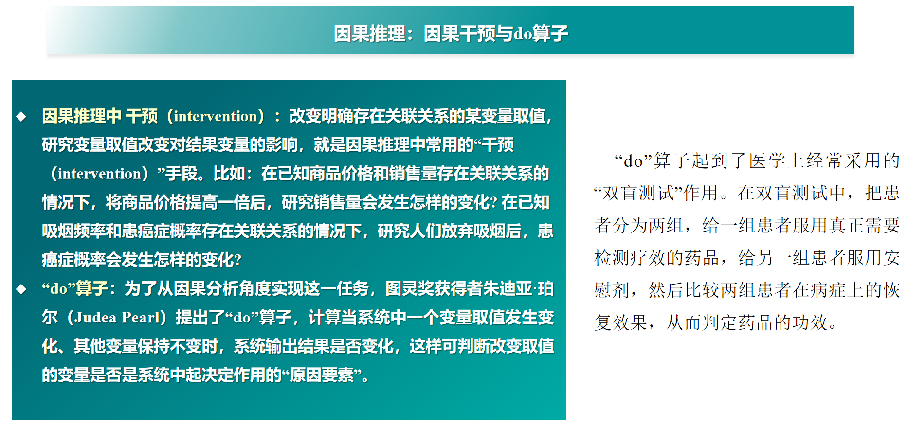

## Lec 4. 机器学习

### 基本概念

- 机器学习通过对数据的优化学习, 建立能够刻画数据中所蕴含语义概念或分布结构等信息的模型. 机器学习可划分为监督学习 (supervised learning)、无监督学习 (unsupervised learning) 及半监督学习 (semi-supervised learning).

- 监督学习: 给定带有标签信息数据的训练集 $\mathcal D=\{(x_i,y_i)\}_{i=1}^n$, 学习一个从 $x_i \to y_i$ 的映射 ($x_i$ 可以是文档、图像、音频等, $y_i$ 即对应的语义内容). 监督学习算法学习得到一个最优映射函数 $f$ (又称决策函数), 实现数据的分类和识别.
- 无监督学习: 只有 $\mathcal D=\{x_i\}_{i=1}^n$.

- 泛化能力 (generalization): 在机器学习中, 需要保证模型在训练集上所取得性能和在测试集上所取得性能保持一致, 即模型具有泛化能力.
- 对于模型评估, 我们采用损失函数 $\text{loss}(f(x_i),y_i)$ 来估量预测值 $\hat{y_i}$ 和真实值 $y_i$ 之间的差异. 显然在训练时我们希望最小化 $\sum\limits_{i=1}^{n} \text{loss}(\hat{y_i},y_i)$.
- 映射函数 $f$ 在训练集上的损失函数值被称为**经验风险 $\mathcal R_{emp}$** (empirical risk), 经验风险越小则模型对训练集拟合程度越好.

$$
\mathcal R_{emp}=\frac{1}{n} \sum_{i=1}^{n} \text{loss}(\hat{y_i},y_i)
$$

- 某一任务理论上可包含的所有数据中, 模型的期望损失函数值被称为**期望风险 $\mathcal R$** (expected risk).

$$
\mathcal R=\int_{x\times y} P(x,y) \text{loss}(\hat{y},y) dxdy
$$

- 为了防止"过学习" (即“经验风险小, 期望风险大”, 模型过于复杂), 引入正则化 (regularizer) 或惩罚项 (penalty term) 来降低模型复杂度, 在经验风险、模型复杂度之间寻找平衡:

  $$
  \frac{1}{n} \sum_{i=1}^{n} \text{loss}(\hat{y_i},y_i) +\lambda J(f)
  $$

  其中 $J(f)$ 是正则化因子或惩罚项因子, $\lambda$ 是用来调整惩罚强度的系数.

- 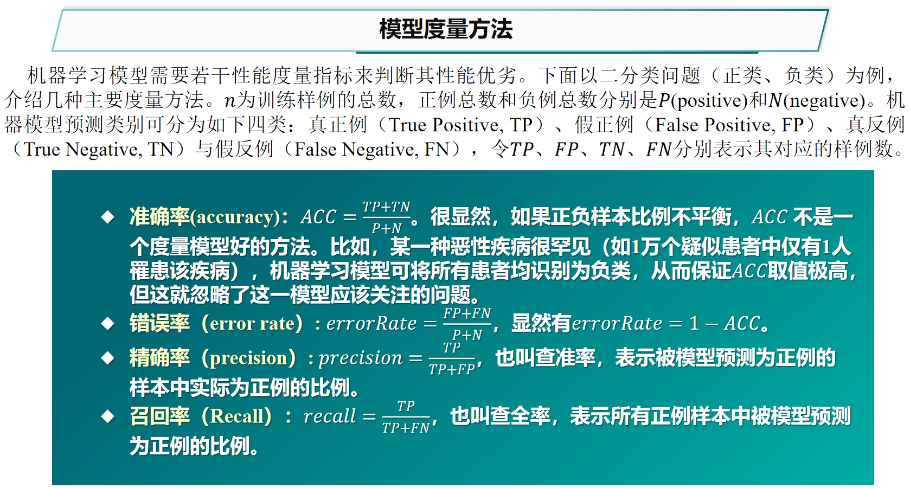

### 监督学习: 回归分析与决策树

- 回归分析: 分析不同变量之间存在的关系. 最简单的比如一元线性回归.
- 一元线性回归: $\hat{y}=ax+b$, 一般采用**最小二乘法**, 即 $L(a,b)=\sum\limits_{i=1}^{n} (y_i-(ax_i+b))^2$, 我们的目标是最小化该损失函数.
  
  分别对 $a,b$ 求偏导, 可以得到:
  
  $$
  \begin{align}
  a&=\frac{\sum_{i=1}^{n} x_iy_i-n \bar{x}\bar{y}}{\sum_{i=1}^{n} x_i^2 -n\bar{x}^2} 
  \notag
  \\
  b&=\bar{y}-a\bar{x}
  \notag
  \end{align}
  $$

- 多元线性回归: 设有 $m$ 个训练数据 $\{(\bold{x_i},y_i)\}_{i=1}^{m}$, 其中 $\bold{x_i}=(x_{i,1},\cdots,x_{i,D})\in \mathbb{R}^D$, $D$ 为数据特征的维度. 线性回归就是要找到一组参数 $\bold{a}=(a_0,a_1,\cdots,a_D)^T$, 使得线性函数:
  $$
  f(\bold{x_i})=a_0+\sum_{j=1}^D a_j x_{i,j}
  $$ 

  最小化均方误差函数:

  $$
  J_m(\bold{a})=\frac{1}{m} \sum_{i=1}^{m} (y_i-f(\bold{x_i}))^2
  $$

  记 $\bold{X}=(\bold{x_1},\cdots,\bold{x_m})^T$ (为方便处理常数项 $a_0$, 我们在每个 $\bold{x_i}$ 前补一个常数 $1$), $\bold{y}=(y_1,\cdots,y_m)^T$, 则 $J_m(\bold{a})=(\bold{y}-\bold{X}\bold{a})^T(\bold{y}-\bold{X}\bold{a})$. 对参数 $\bold{a}$ 求偏导得 $\frac{\partial J(\bold{a})}{\partial \bold{a}}=-2\bold{X}^T(\bold{y}-\bold{X}\bold{a})$.

  因此极小值点为 $\bold{a}=(\bold{X}^T \bold{X})^{-1}\bold{X}^T \bold{y}$.

- logistic 回归: 线性回归有一个很明显的问题是它对离群点非常敏感, 可能导致模型不稳定, 为了缓和这个问题带来的影响, 我们采用非线性回归模型. 
  
  现在引入 sigmoid 函数, 回归模型表示如下:

  $$
  y=\frac{1}{1+e^{-z}} \\

  z=\bold{w}^T \bold{x}+b
  $$

  其中 $\bold{x}\in \mathbb R^d$ 是输入数据, $\bold{w}\in \mathbb R^d$ 和 $b\in \mathbb R$ 是回归模型的参数.

  我个人认为, 这里的"回归"更像是"分类", sigmoid 得出的 $y$ 其实应该理解为概率 $p$, 也就是说有 $p$ 的概率认为是类别 $1$, $1-p$ 的概率认为是类别 $0$.

- softmax 回归: 前面 logistic 只能用于解决二分类问题, 将其推广成处理多分类问题, 那就是 softmax 回归.

- 决策树: 选择某个属性, 对样本集进行划分, 然后递归, 直至每个子样本为同一个类别 (非常类似 KD-Tree). 由此可见划分属性的顺序是很重要的, 性能好的决策树随着划分的不断进行, 分支节点样本集的"纯度"会越来越高, 即所包含的样本尽可能属于相同类别.
  
  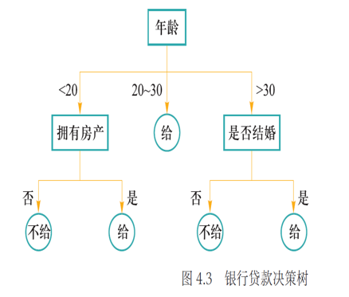

  如何刻画"纯度"呢? 我们引入了信息熵 (entropy), 它就是一种指标: 信息熵越大, 说明该集合的不确定性越大. 假设有 $K$ 类信息, 共同组成了集合样本 $D$. 记第 $k$ 哥信息发生的概率为 $p_k$, 定义信息熵 $Ent(D)=-\sum\limits_{k=1}^{K} p_k \log_2 p_k$.

  举个例子, 比如 $14$ 个样本中有 $9$ 个"给予贷款"、$5$ 个"不给予贷款", 那么类别数 $K=2$, 并且 $Ent(D)=-(\frac{9}{14}\cdot \log_2 \frac{9}{14}+\frac{5}{14}\cdot \log_2 \frac{5}{14})$.

  选择属性划分样本前后信息熵的减少量称为**信息增益 (information gain)**, 用于衡量样本集合复杂度 (不确定性) 减少的程度. 由此我们据此可以去寻找信息增益最大的划分方式, 不断进行递归处理, 得到优质的决策树.

### 无监督学习: K 均值聚类

- K-means 算法的目标是将 $n$ 个 $d$ 维数据 $\{\bold{x_i}\}$ 划分为 $K$ 个聚簇, 使得簇内方差最小化.

  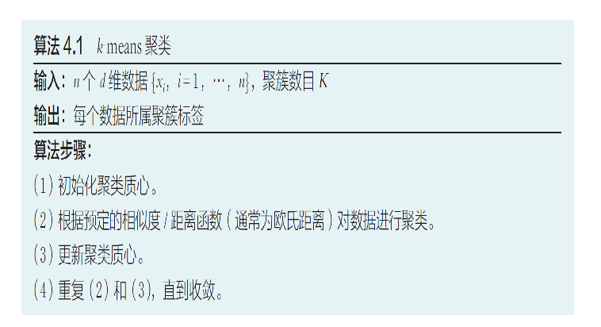

  初始化 $K$ 个聚类质心 $C=\{c_1,\cdots,c_K\}$, 对每个数据纳入离它最近的质心的聚类集合, 根据聚类结果一次性更新聚类质心. 不断迭代以上过程, 直到收敛.

  $$
  \arg \min_G \sum_{i=1}^{K} \sum_{x\in G_i} ||x-C_i||^2=\arg \min_G \sum_{i=1}^{K} |G_i| \text{Var}(G_i)  
  $$

  K-means 聚类就是通过最小化聚簇内的数据方差, 以此来实现最大化类内相似度的.

### 监督学习与无监督学习下的特征降维

- 线性判别分析 (linear discriminant analysis, LDA): 基于监督学习的降维方法. 对于一组高维数据样本, LDA 利用其类别信息, 将其线性投影到一个低维空间上, 使得: 在低维空间中, 同一类别的样本尽可能靠近, 不同类别的样本尽可能彼此远离.
  
  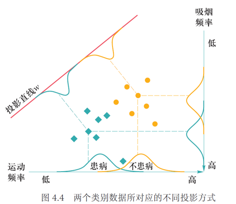

  假设样本集为 $\mathcal D=\{(x_i,y_i)\}_{i=1}^{n}$, 样本 $\bold{x_i}\in \mathbb R^d$ 的标签为 $y_i$ (其中 $y_i$ 的取值范围是 $\{C_1,\cdots,C_k\}$). 
  
  定义 $\bold{X}$ 为所有样本构成的集合、$N_i$ 为第 $i$ 个类别所包含样本个数、$\bold{X_i}$ 为第 $i$ 类样本的集合, $\bold{m}$ 为所有样本的均值向量, $\bold{m_i}$ 为第 $i$ 类样本的均值向量. 

  记 $\sum_i$ 为第 $i$ 类样本的协方差矩阵, 则 $\sum_i =\sum\limits_{\bold{x}\in \bold{X_i}} (\bold{x}-\bold{m_i})(\bold{x}-\bold{m_i})^T$.

  考虑一个简单点的情形, $K=2$ (即二分类问题, 训练样本归属于 $C_1$ 或 $C_2$ 两个类别). 假如我们通过如下线性函数投影到一维空间上: $y(\bold{x})=\bold{w}^T\bold{x}$, 其中 $\bold{w}\in \mathbb R^d$. 那么投影之后类别 $C_1$ 的协方差矩阵 $s_1$ 为:
  
  $$
  s_1=\sum_{\bold{x}\in C_1} (\bold{w}^T\bold{x}-\bold{w}^T\bold{m_1})^2=\bold{w}^T \sum_{\bold{x} \in C_1} [(\bold{x}-\bold{m_1})(\bold{x}-\bold{m_1})^T]\bold{w}
  $$
 
  我们惊奇的发现 $s_1=\bold{w}^T \sum_1 \bold{w}$. 由于将数据样本投影到了一维空间, 所以这里 $s_1,s_2$ 都是实数 ($s_1,s_2$ 可用来衡量同一类别的样本之间的"分散程度"). 此外, $m_1=\bold{w}^T \bold{m_1},m_2=\bold{w}^T\bold{m_2}$. 
  
  对于特征降维, 无非就是寻找最优的 $\bold{w}$. 我们希望最大化如下目标 $J(\bold{w})$:

  $$
  \begin{aligned}
  J(\bold{w})&=\frac{||m_2-m_1||^2}{s_1+s_2}\\
  &=\frac{||\bold{w}^T(\bold{m_2}-\bold{m_1})||^2_2}{\bold{w}^T \sum_1 \bold{w}+\bold{w}^T \sum_2\bold{w}}\\
  &=\frac{\bold{w}^T (\bold{m_2}-\bold{m_1})(\bold{m_2}-\bold{m_1})^T \bold{w}}{\bold{w}^T (\sum_1+\sum_2)\bold{w}}
  \end{aligned}
  $$

  其中, 我们通常定义 $\bold{S_b}=(\bold{m_2}-\bold{m_1})(\bold{m_2}-\bold{m_1})^T$ 为**类间散度矩阵 (between-class scatter matrix)**, 衡量两个类别均值点之间的"分离"程度; $\bold{S_w}=\sum_1+\sum_2$ 为**类内散度矩阵 (within-class scatter matrix)**, 衡量每个类别中数据点的"分离"程度.

  之后的求导过程是平凡的, 得到 $\bold{w}=\bold{S_w}^{-1}(\bold{m_2}-\bold{m_1})$.

- 主成分分析 (principal component analysis): 分析数据特征的主要成分, 使用这些主要成分来代替原始数据.
  
  首先记**样本方差 (sample variance)** 为 $\text{var}(x)=\frac{1}{n-1} \sum\limits_{i=1}^{n} (x_i-u)^2$, 其中 $u=\frac{1}{n} \sum\limits_{i=1}^{n} x_i$ 为样本均值. 梦回普物实验啊, 分母为 $n-1$ 的目的是让方差的估计是无偏估计, 其实我也不懂.

  **协方差**衡量了两个变量之间的相关度, $\text{cov}(X,Y)=\frac{1}{n-1}\sum\limits_{i=1}^{n} (x_i-E(X))(y_i-E(Y))$. 但协方差会受到变量取值尺度的影响, 因此我们通常用**相关系数 (correlation coefficient)** 将两组变量之间的关系规整到一定的取值范围内,

  $$
  \text{corr}(X,Y)=\frac{\text{Cov}(X,Y)}{\sqrt{\text{Var}(X)\text{Var}(Y)}}\in [-1,1]
  $$

  主成分分析的思想是将 $d$ 维特征数据映射到 $l$ 维空间 (一般来说 $d>>l$), 去除原始数据之间的冗余性. 降维需要尽可能将数据往**方差最大的方向**进行投影. 一旦发现了方差最大的投影方向, 则继续寻找保持方差第二的方向且进行投影, 其目标是使得数据每一维的方差都尽可能大.

  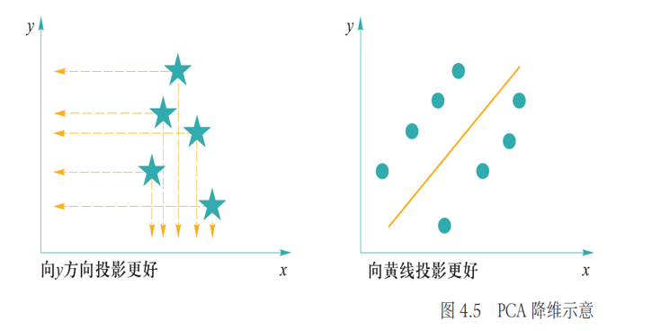

  具体的实现细节, PPT 上也没写, 我也不想知道.

- 主成分分析可用于"特征人脸"识别.

### 演化学习

- 说了半天不就是遗传算法吗, 感觉了解即可. 没啥用.

## Lec 5. 神经网络与深度学习

### 前馈神经网络 (FNN, Feedforward Neural Network) 与参数优化

- 神经网络基本单元: MCP 神经元. 下面是 MCP 模型:
  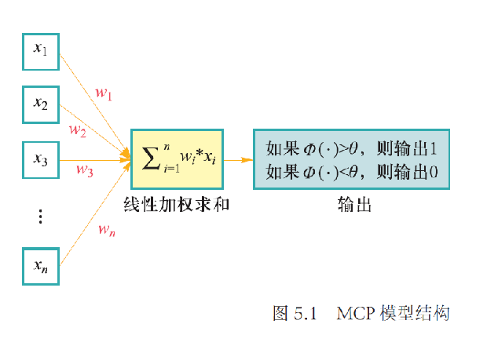
  $$
  y=\Phi(\sum\limits_{i=1}^{n} w_i \times x_i)
  $$
- 早起的感知机 (单层感知机), 其实跟 MCP 模型差不多, 都是二分类:
  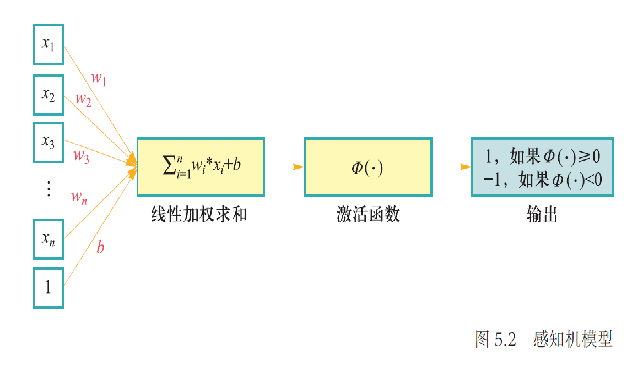
- 上面的做法遇到 XOR 就嗝屁了 (因为 XOR 线性不可划分). 因此在感知机模型中增加若干隐藏层, 增强神经网络的非线性表达能力, 就会让神经网络具有更强的拟合能力. 因此, 由多个隐藏层构成的**多层感知机**被提出, 这是**前馈神经网络**的一种.
  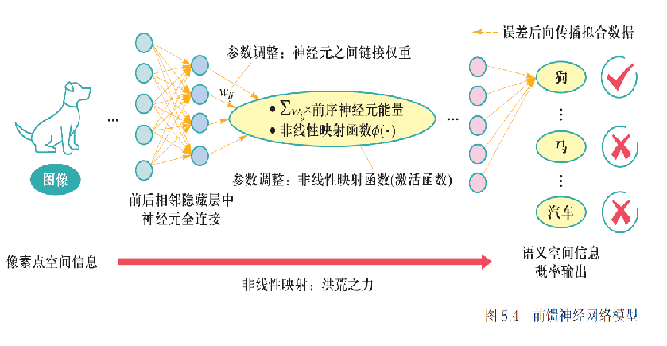
- 非线性映射的常见激活函数:
  - Sigmoid: $f(x)=\frac{1}{1+e^{-x}}$.
  - Relu: $f(x)=\max(0,x)$.
  - Softmax: $y_i=\text{softmax}(x_i)=\frac{e^{x_i}}{\sum\limits_{k=1}^{n} e^{x_k}}$. 它相当于 logistic 回归的一种推广, 可应用于多分类问题.
- 神经网络的参数优化是一个监督学习的过程. 给定 $n$ 个标注样本数据 $(x_i,y_i)$, 假设预测得到的结果为 $\hat{y_i}$, 我们可以通过**损失函数**来计算模型的误差, 据此优化模型的参数. 常见的损失函数有:
  - 均方误差损失函数: $\text{MSE}=\frac{1}{n} \sum\limits_{i=1}^{n} (y_i-\hat{y_i})^2$.
  - 交叉熵损失函数: $H(y_i,\hat{y_i})=-y_i\times \log \hat{y_i}$. 简单求导可知, $\{y_i\}$ 与 $\{\hat{y_i}\}$ 的分布越接近, 交叉熵越小.
- 定义好损失函数, 我们需要设计优化参数的方法, 常见的方法是**梯度下降**.
  - 梯度的反方向是函数值下降最快的方向, 因此是损失函数求解的方向
  - 设置学习率 $η$, $\bold{x}\leftarrow \bold{x}-η \cdot (∇f(\bold{x}))$.
  - 三种类型:
    - 批量梯度下降 (batch gradient descent): 直接在整个训练集上计算 $L(\theta)$. 这带来的问题是, 如果数据集较大, 容易 OOM.
    - 随机梯度下降 (**SGD**, stochastic gradient descent): 拿某个样本计算 $L(\theta)$. 由于只拿一个, 可能会导致梯度波动很大, 收敛速度会比较慢. 尽管如此, 它有助于跳出局部最优解, 有时可能找到更优的解.
    - 小批量梯度下降算法 (mini-batch gradient descent): 选取小批量样本计算 $L(\theta)$, 根据每一小批样本的累计误差来更新参数. 这样可以保证训练过程更稳定, 采用批量计算也可以利用矩阵计算的优势, 目前最常用. 
  - 求梯度, 用链式法则. 就是 fds 学过的自动求导 (autograd).

### 卷积神经网络 (Convolutional Neural Network)

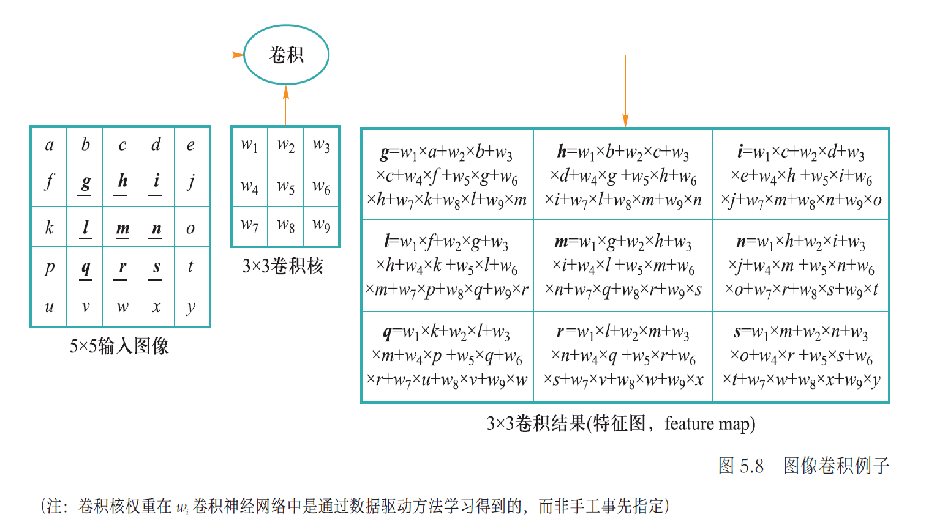

- 下采样 (down sampling): 例如上图, 本来分辨率 $5\times 5$, 卷积完变成了 $3\times 3$.
- 填充 (padding): 边缘像素点的周围填充 $0$, 防止下采样.
- 步长 (stride): 步进长度. 像前面, 就是默认的 stride 为 $1$. 

- 池化 (pooling):
  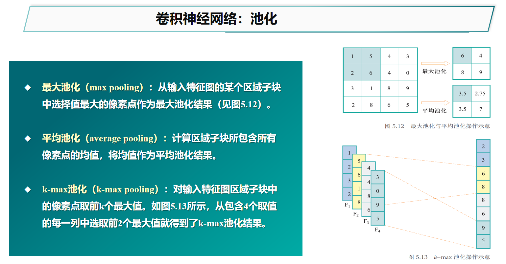

### 循环神经网络 (Recurrent Neural Network)

- 先前的前馈神经网络、卷积神经网络要求输入数据一次性给定, 难以处理存在前后依赖的数据.

- 在每一时刻 $t$, 循环神经网络单元会读取当前输入数据 $x_t$ 和前一时刻输入数据 $x_{t-1}$ 对应的**隐式编码结果** $h_{t-1}$, 一起生成 $t$ 时刻的隐式编码结果 $h_t$. 接着将 $h_t$ 后传, 参与生成 $t+1$ 时刻……依次类推

  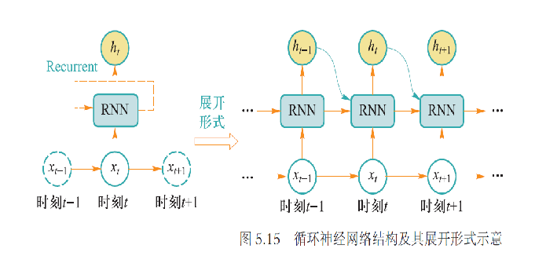

  $$
  h_t=\Phi(W_x\times x_t+W_h\times h_{t-1}+b)
  $$

  其中 $\Phi(·)$ 是激活函数, 一般可为 sigmoid 或者 tanh. $W_x$ 与 $W_h$ 为模型参数.

- 循环神经网络虽然具有一定的记忆能力, 但当相关信息在序列中相距较远时, 循环神经网络无法捕捉到数据之中的时序依赖关系.

- 除此之外, 当输入序列过长时, 也容易出现梯度消失 (gradient vanishing) 或者梯度爆炸 (gradient exploding) 的问题. 因为 $\tanh$ 的导数 $\in (0,1)$, 多乘几个就 eps 大小了.

- 为了缓解梯度消失的问题, 我们提出了**长短时记忆模型** (LSTM, Long Short-Term Memory):
  - 引入**内部记忆单元** (internal memory cell) 和**门** (gates) 结构来对当前时刻输入信息以及前序时刻所生成信息进行整合和传递. 
  - 内部记忆单元中信息可视为对“历史信息”的累积.
  - 三种门结构: 输入门 (input gate), 遗忘门 (forget gate) 和输出门 (output gate). 对于给定的当前时刻输入数据 $x_t$ 和前一时刻隐式编码 $ℎ_{t−1}$, 输入门、遗忘门和输出门通过各自参数对其编码, 分别得到三种门结构的输出 $i_t$、$f_t$ 和 $o_t$.
  - 在此基础上, 结合前一时刻内部记忆单元信息 $c_{t−1}$ 来更新当前时刻内部记忆单元信息 $c_t$, 最终得到当前时刻的隐式编码 $ℎ_t$.
  
  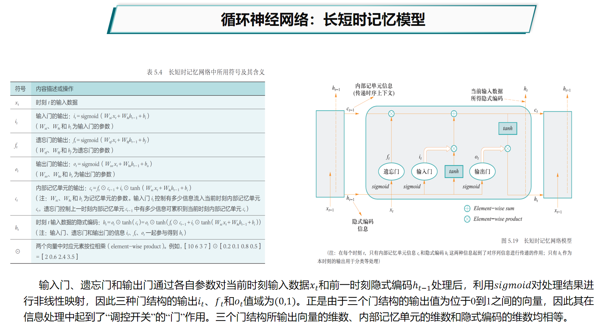

  这里的图应该挺直观的, 但小心右边的 $\tanh$ 是要带上点系数的, 不是直接传入 $h_{t-1}$. 
- 在门中: sigmoid 函数将值域控制在 $(0,1)$, 起到了信息"控制门"的作用. $=0$ 表示信息关闭; $=1$ 表示信息全开.
- 在内部记忆单元和隐式编码中: 采用 $\tanh$ 是因为它的值域在 $(-1,1)$, 起到信息为"增 (正)"或"减 (负)"的作用.

### 注意力与正则化

- 首先生成每个单词的内嵌向量 (包含了单词在句子中位置编码向量信息), 记为 $w_i$. 接着如下计算每个单词 $w_i$ 的查询向量 (query)、键向量 (key) 和值向量 (value):
  - $q_i=W^q \times w_i$;
  - $k_i=W^k \times w_i$;
  - $v_i=W^v \times w_i$.
- 可以看到, 对于每个单词而言, $W^q,W^k,W^v$ 三个映射矩阵都是一样的, 也是自注意力模型需要训练的全部参数. 自注意力模型就是要挖掘 $w_i$ 与其他单词在句子中因为上下文 (context) 关联而具有的自注意力取值大小. 

  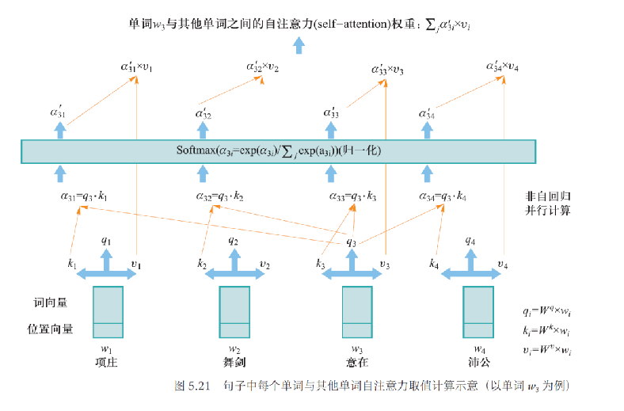

- 当然，也可引入“多头”注意力 (multi-headed attention) 机制从更多角度来挖掘某个单词与其他单词之间概率关联. 同时也应该了解, 每个单词的自注意力关联可并行计算, 而不像循环神经网络 RNN 那样, 需要通过自回归的方式来一个单词接着一个单词来处理.

- 神经网络正则化: **dropout**, **批归一化**.

  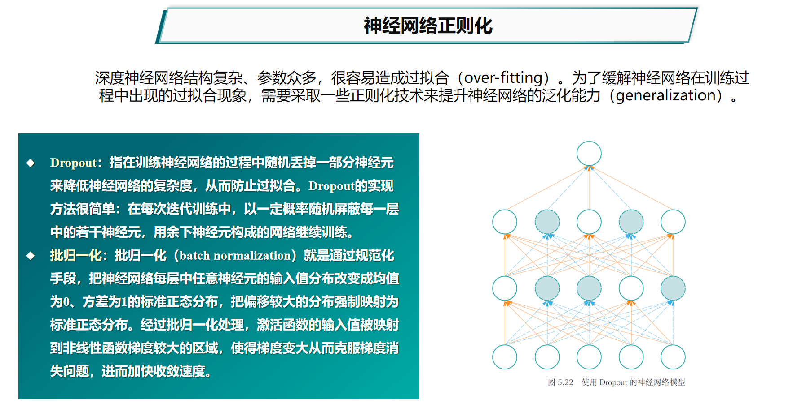

  加入正则化项后, 神经网络的损失函数一般可如下表示:

  $$
  \min \frac{1}{n} \sum_{i=1}^{n} \underbrace{\text{Loss}(y_i,f(\bold{W},x_i))}_{\text{损失函数}} + \underbrace{\lambda}_{\text{正则化权重}} \times \underbrace{\Phi(\bold{W})}_{\text{正则化项}}
  $$

  一般用 $L_1$ 或 $L_2$ 正则化.
  - $L_1$ 范数: $||W||_1=\sum |w_i|$. $L_1$ 也被称为"稀疏规则算子".
  - $L_2$ 范数: $||W||_2=\sqrt{\sum w_i^2}$.

### 深度学习在自然语言和计算机视觉中的应用

- 在基于规则和统计的传统方法中, 一个单词按照词典序被表示为一个词典维数大小的向量 (**one-hot vector**), 向量中该单词所对应位置按照其在文档中出现与否取值为 1 或 0.
- 为了刻画不同单词之间的语义相关性，研究人员希望使用一种分布式向量表达 (distributed vector representation) 对不同单词进行表达. 利用深度学习模型, 可将每个单词表征为 $N$ 维实数值的分布式向量.
  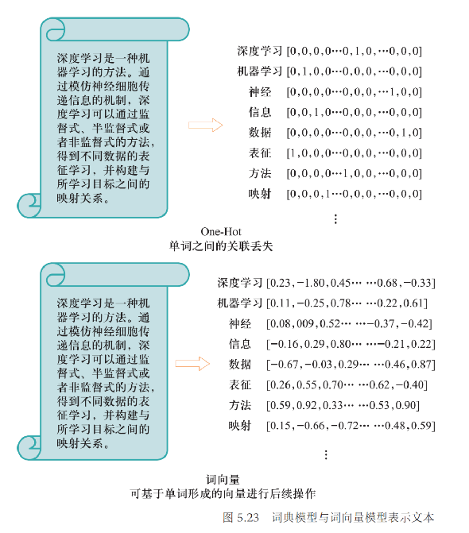
- 那么如何得到这样一个 $N$ 维实数向量呢? 很简单, 拿 one-hot vector 作为输入, 训一个网络:
  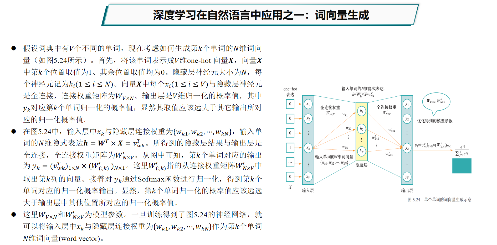

## TODO

其实我觉得有必要学习一下求导. 如果A是实对称矩阵，则x^TAx对x的导数为dx^TAx/x=2Ax
