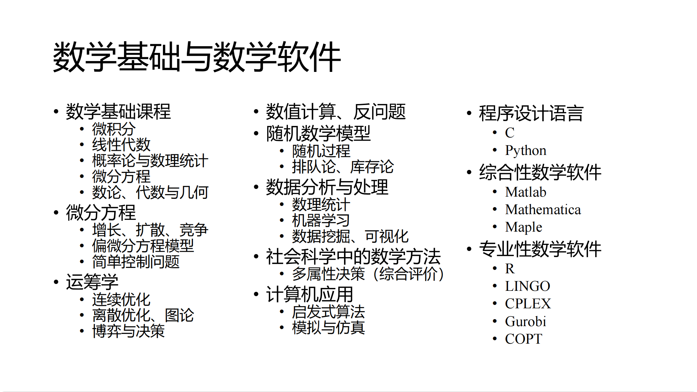

## 数学建模概论

课堂讲授内容:
- 数学建模概述
- 基本数学模型
- 运筹与统计
- 数学应用专题

## Google 搜索引擎的 PageRank 模型

设计的出发点在于: 对于搜索的关键词, 如何制定一个合理的网页排序规则, 使得"重要"的网页在搜索结果中靠前显示.

而 PageRank 的网页排序机制基于以下两点:
- 互联网中的网页通过超链接 (hyperlink) 关联;
- 网页的重要程度由网页之间的链接关系决定.

将互联网看作一张图, 顶点就是网页 $v_1,v_2,\cdots,v_n$, 若网页 $v_i$ 上有链接指向网页 $v_j$, 则有一条 $i\to j$ 的边. 称这样图叫**网络链接图**.

用形式化的语言表述, 记 $q_i$ 表示网页 $i$ 中有多少个链接, **链接矩阵** $\mathbf{P}$ 满足 $p_{i,j}=\begin{cases} \frac{1}{q_j} & (j,i) \in E \\ 0 &  \text{otherwise}\end{cases}$, $\mathbf{X}=(x_1,\cdots,x_n)^T$ 为**网页重要度向量**, 显然有 $\mathbf{X}=\mathbf{PX}$.

也就是说, $\mathbf{X}$ 为线性方程组 $\mathbf{X}=\mathbf{PX}$ 的解, 它有如下特性:
- $\text{rank}(\textbf{I}-\textbf{P})<n$;
- 矩阵 $\mathbf{P}$ 有特征值 $1$.

为了证明这两条特性, 先引入一些线性代数里的概念.

> - 随机矩阵 (row stochastic matrix): 各行 (列) 元素之和均为 $1$ 的**非负方阵**称为行 (列) 随机矩阵.
> - 双随机矩阵: 各行与各列元素之和均为 $1$ 的**非负方阵**.
> 
> 随机矩阵有一个特点: 它的特征值的绝对值 $\le 1$.
>
> Proof. 设 $\lambda$ 是行随机矩阵 $\mathbf{P}$ 的特征值, 非零向量 $\mathbf{X}$ 是 $\lambda$ 的特征向量. 
>
> 记 $|x_i|=\max\limits_{1\le j\le n} |x_j|$, 则有 $\lambda x_i=\sum\limits_{j=1}^{n} p_{i,j}x_j$. 两边取绝对值, 得到 $|\lambda| |x_i|\le \sum\limits_{j=1}^{n} |p_{i,j}x_j|\le |x_i| \sum\limits_{j=1}^{n} |p_{i,j}|=|x_i|$, 因此 $|\lambda|\le 1$. 

显然链接矩阵是列随机矩阵. 后面课件写的一坨大便, 再说.

## 
