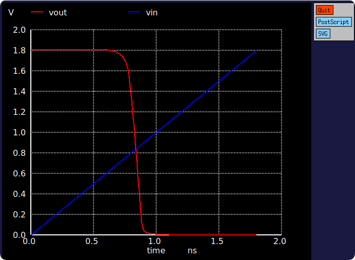
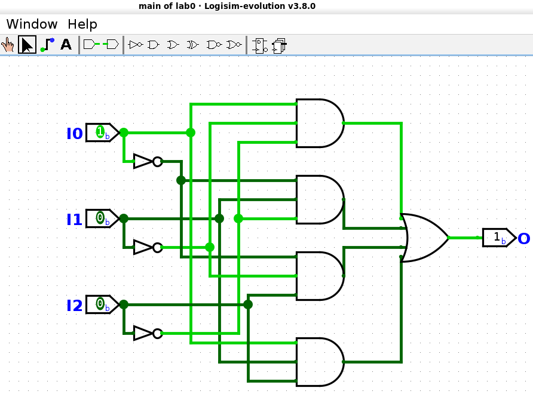
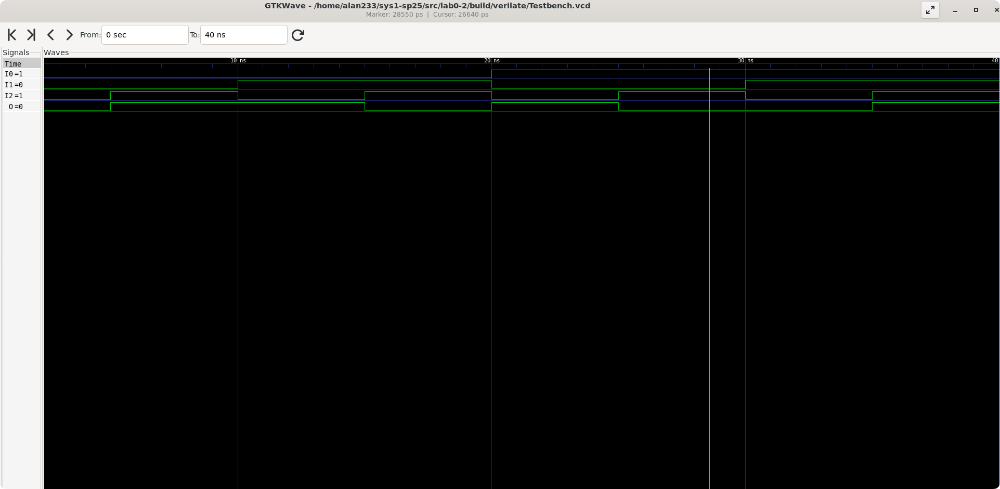

## lab0-1: 反相器的电压传输特性

SPICE 是一种电路模拟软件, 可以模拟各种电路的行为和性能. 它有很多不同的版本, NGSPICE 是目前最广泛使用的开源版本实现.

由于后续的实验用不到它, 我懒得存放它, 用完即删, 记录下命令.

```bash
sudo apt install ngspice
ngspice inv.sp
sudo apt purge --autoremove ngspice
```



## lab0-2: Logisim 电路仿真

Logisim 是一种数字逻辑电路仿真工具, 用于模拟数字电路的行为和性能. 我们使用的 Logisim-evolution 是原本 Logisim 的扩展版本, 增加了许多新特性和改进, 使得它更加易用和强大.

首先安装 java 运行环境, 再下载 logisim-evolution. 

```bash
sudo apt install openjdk-17-jre
wget https://git.zju.edu.cn/zju-sys/sys1/sys1-sp23/uploads/bed18108ed82dc45f20f435403d8fdef/logisim-evolution-3.8.0-all.jar
```

接着启动 `java -jar logisim-evolution-3.8.0-all.jar` 开始绘制电路.



导出 Verilog 文件后, 波形图如下.



## lab0-3

跟 lab0-2 类似, 只不过这次代码是要手写, 之前是由 Logisim-evolution 自动生成.


